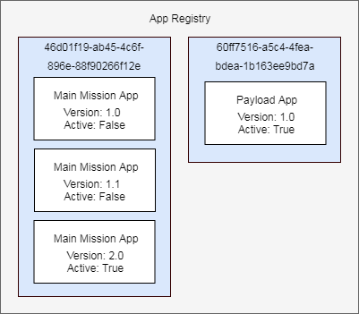

Kubos Applications Service
==========================

The Kubos applications service is responsible for monitoring and managing all mission applications for a system.

TODO: Something something installation, upgrades, and recovery

TODO: User/App/Service interaction diagram

Whenever a new application is registered with the service, its path and manifest file are copied into the service's application registry.
By default, this registry is stored under `/home/system/kubos/apps`.

Each application will be automatically assigned a UUID to be used for identification purposes internally.
Using UUIDs, rather than the application's name, allows users the freedom to adjust the application name as they see fit,
for instance if the overall purpose of the application changes and they would like to update the name to reflect that in later versions.

Communicating with the Service
------------------------------

The applications service uses the same UDP+GraphQL communication scheme as the :doc:`other service <../services/graphql>`.

Users will send GraphQL queries and mutations to the service's UDP port.
The port number can be found in the systems configuration file in `/home/system/etc/config.toml`

Querying
--------

A current list of all available versions of all registered applications can be generated by using the ``apps`` query.

TODO: Update these once the schema is solidified

For example::

    {
        apps {
            uuid,
            metadata {
                name,
                version
            }
    }
    
Using our example registry, the data returned by the service would be::

    {
        "apps": [
            "uuid": "46d01f19-ab45-4c6f-896e-88f90266f12e",
            "metadata": {
                "name": "main-mission",
                "version": "1.0"
            }
            TODO: finish me
        ]
    }

To list all available versions of a specific application, specify the desired UUID as an input parameter.

For example::

    {
        apps(uuid: 60ff7516-a5c4-4fea-bdea-1b163ee9bd7a) {
            metadata {
                name,
                version
            }
        }
    }

Registering
-----------

TODO: How to transfer app to stack. Can probably link to some other doc

Once the application has been transfered to the OBC, users can register it with the applications service using
the ``register(path: {path/to/app})`` mutation.

The service will copy the application from the specified path into the apps registry.
Once registered, users may delete the original application.

For example::

    mutation {
        register(path: /home/kubos/payload-app) {
            active,
            app {
                name,
                version
            }
        }
    }

If the ``active`` response field is ``True``, then the registration completed successfully.
If the registration fails for some reason, then the service will return an error response.    

De-Registering (TODO: is that even a word?)
-------------------------------------------

Upgrading
---------

Users may register a new version of an application without needing to remove the existing registration.

To do this, they will use the ``register`` mutation with the optional ``uuid`` input parameter::

    mutation {
        register(path: /home/kubos/payload-app, uuid: 60ff7516-a5c4-4fea-bdea-1b163ee9bd7a) {
            active,
            app {
                name,
                version
            }
        }
    }

Recovery
--------

Is not a thing that actually exists yet...

TODO: Is it possible to do manual rollback?

Customizing the Applications Service
------------------------------------

The configuration for the applications service is saved in `/home/system/etc/config.toml`.
This file can be editted to add or modify the following fields:

- [app-service.addr]

    - ip - The IP address that the service will use
    - port - The UDP port GraphQL requests should be sent to
    
- [app-service]

    - registry-dir - *(Default: /home/system/kubos/apps)* The directory under which all registry entries should be stored

TODO: Any other options?