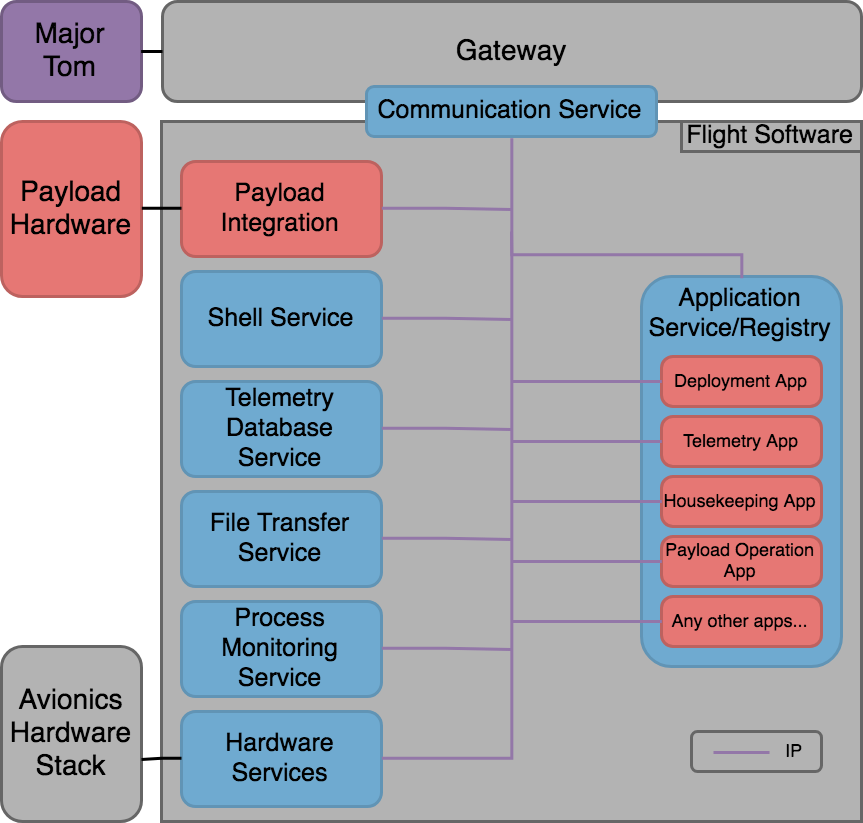

KubOS Architecture Overview
===========================

The KubOS system is designed to take care of every aspect of the satellite flight software. From the board up, it has every component you need to complete a mission. 

The KubOS Stack
---------------

.. figure:: images/architecture_stack.png
    :align: center

OBC (On Board Computer)
~~~~~~~~~~~~~~~~~~~~~~~

Starting from the bottom, the OBC is up to you, as long as it is in our supported list. The current list of supported OBCs can be found :doc:`here <index>`. We are also continually working to support new platforms, so make sure you talk to us if your OBC is not included! 

Kubos Linux
~~~~~~~~~~~

Kubos Linux is Kubos's Linux build (pretty self explanatory). If you want more information on how it works, what's included, etc, Check it out :doc:`here <os-docs/index>`. 

Kubos APIs
~~~~~~~~~~

There are several Kubos APIs for accomplishing a variety of tasks within Kubos Linux, but the main definition is that they are all statically linked libraries. Anything that behaves this way is considered an API, regardless of what hardware is it interacting with. For example, there are APIs for UART and I2C communication, as well as interaction with specific hardware such as the ISIS iMTQ. You can get more information about what APIs are available and what they do later in this document and :doc:`here <apis/index>`. 

Kubos Services
~~~~~~~~~~~~~~

The last Kubos portion of the stack is the Kubos Services. These are defined as any persistent process that is used to interact with the satellite. Services rarely make decisions, but will allow the user to accomplish typical Flight Software tasks such as telemetry storage, file management, shell access, hardware interaction, etc. More information about the scope of services can be found later in this document and :doc:`here <services/index>`. 

Mission Applications
~~~~~~~~~~~~~~~~~~~~

The final portion of the KubOS system is the Mission Applications. These applications are anything that governs the behavior of the satellite. Some common examples are deployment, housekeeping, and telemetry beaconing. Basically anything that you want the satellite to do autonomously goes into this category. More information on Mission Applications can be found later in this document and :doc:`here <applications/index>`. 

Typical Mission Architecture
----------------------------

In the above diagram, everything in blue is typically Kubos-developed, while everything in green would be mission code and written by the user for their specific mission and payload. 

Communication
~~~~~~~~~~~~~

There is internal communication and external communication, all of which is conducted over different types of IP. 

Gateways
^^^^^^^^

Gateways are any and all communication routes to the satellite. This ranges from desktop serial connection to in flight radio link through a ground station. This is mainly just a term to encompass and abstract the notion of the connection to the satellite. 

Communication Service
^^^^^^^^^^^^^^^^^^^^^

The Communication Service is what integrates the Gateway (and the API developed for it) to talk to the Mission Operates Center, Major Tom. For more information on how it operates, refer to the documentation :doc:`here <services/communication-service>`. 

Hardware Integration
~~~~~~~~~~~~~~~~~~~~

For a list of the hardware currently supported by KubOS, look :doc:`here <index>`. 

Supported hardware is hardware that has both an API and an associated service. This architecture allows us to integrate hardware from several different vendors while keeping the application layer mostly hardware independent. Any supported hardware configuration can be used without changing mission application code.

Hardware Services
^^^^^^^^^^^^^^^^^

Hardware Services are GraphQL Server endpoints that take in Queries and Mutations and exercise the Hardware API to complete them. More information on Hardware Services can be found :doc:`here <services/hardware-services>`, and more information on GraphQL can be found :doc:`here <services/graphql>`. 

Hardware APIs
^^^^^^^^^^^^^

Hardware APIs are a 2 tier system. The lower tier is specific to the exact piece of hardware and it's configuration, and must be written for every piece of hardware integrated. The upper tier accesses the lower tier, and is accessed by the associated Hardware Services. This upper tier is mostly portable between different units of similar purpose (eg, different brands of battery or ADCS), but sometimes must be augmented. More detailed descriptions of the different layers and current supported hardware APIs can be found :doc:`here <apis/index>`. 

Core Services
~~~~~~~~~~~~~

The Core Services are all the services that provide critical Flight Software capability. Any service that does not interact with hardware or is not specific to a mission falls within this category. Each of these services are discussed in the Services section found :doc:`here <services/core-services>`.

Mission Specific Code
~~~~~~~~~~~~~~~~~~~~~

If you're mostly concerned with "What do I actually need to develop?" this section is for you. Things that have to be written or changed no matter what are the Payload Service and the Mission Applications. These are highlighted in green in the mission diagram above. 

Payload Service
^^^^^^^^^^^^^^^

It is recommended to integrate a payload in the same way as the rest of the bus hardware. An example of a Payload Service can be found :doc:`here <services/example-payload-service>`. That being said, the Payload Service is custom for the mission, and can be accomplished any way the payload developer sees fit. The only hard requirement is that it can send/receive IP communication to connect with the rest of the services.  

Mission Applications
^^^^^^^^^^^^^^^^^^^^

The Mission Applications, as previously discussed, handle all the onboard decision making. They are monitoring the battery to make sure the proper systems get turned off when it's low, they handle abort procedures when an operation encounters an error, they handle what telemetry gets beaconed, how often, and where it goes, etc. These are, by nature, mission specific, but some of them can be largely reused due to the abstract nature of the hardware integration, such as the housekeeping or telemetry logging applications. These are typically written or adapted by the user. More information, requirements, examples, and formatting for these can be found :doc:`here <applications/index>`.
