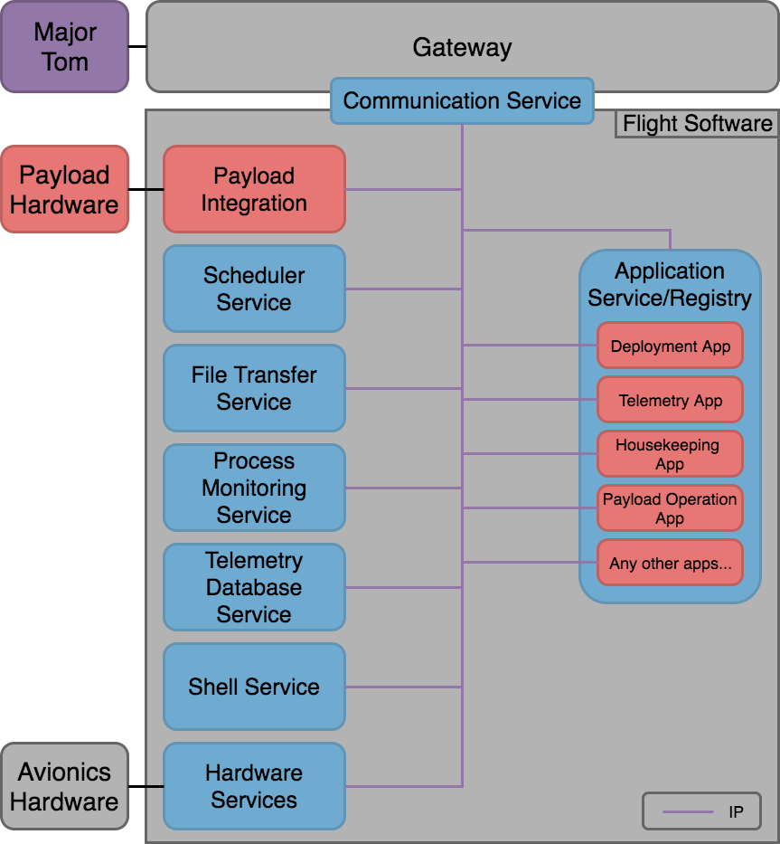

KubOS Architecture Overview
===========================

This document is designed to give you an high level understanding of the philosophy behind KubOS, and how that philosophy is reflected in KubOS.
If you want an in depth description of each of these components and their capability, check out the :doc:`KubOS Ecosystem <os-docs/index>` document, and the numerous pages it links to.

What is KubOS?
--------------

KubOS is a collection of microservices that accomplish critical functionality required of flight software (FSW),
runs within a highly fault tolerant and recoverable operating system,
and provides a safe and effective development environment for mission specific FSW applications.

Microservices
-------------

The microservice architecture of the critical FSW functionality keeps our system remarkably stable,
but maintains agility for feature and technology improvements.
The diagram below shows the typical architecture for a mission running KubOS:

Each of the boxes are independent processes, or *microservices*.
For example, we can revise the communication service to support a new radio, and the binaries of *all other services* are unchanged.
This can be useful between missions, to truly maintain flight heritage on the components that need no revisions,
or it can be useful during a mission, as each process can be updated, on orbit, reliably and independently.

Operating System
----------------

KubOS uses a combination of Linux and U-boot to make up its operating system.

Linux is a far more abstract OS than is typically used for satellite software, which does mean it is more resource intensive.
But, as satellite on board computers have become substantially more capable, the benefits of Linux start to become more important:

- Services are completely portable between any KubOS supported OBC, requiring no code changes
- Enables the ability to leverage the microservice architecture mentioned above, as it has to tools we need for process boundaries and controls
- A user friendly development environment that can protect developers from mistakenly bringing down the whole system

Since Linux is far more complex, it does come with inherent risks, which KubOS combats by pairing it with U-boot.
U-boot is a widely used bootloader that manages the Linux kernel and the core of our system, making sure there are backups stored on board for failover in the event of a catastrophic event.
This bootloader also gives us the capability to update the *entire operating system*, if a single process update is insufficient.

Development Environment
-----------------------

TODO: describe the general idea behind the development environment and it's benefits, but don't repeat the getting started.

TL;DR - If you use our super duper tools, we generally protect you from yourself, but you can do whatever you want if you need to.
