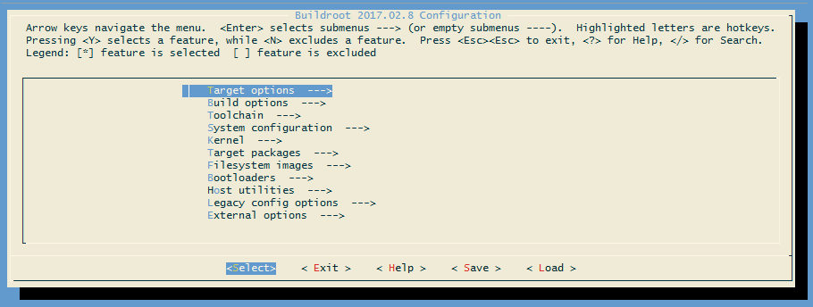
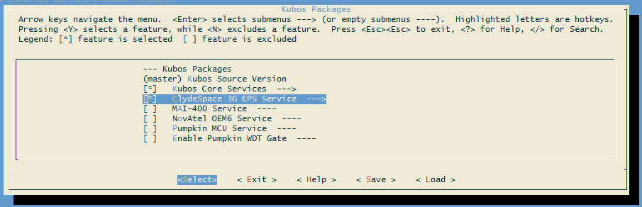
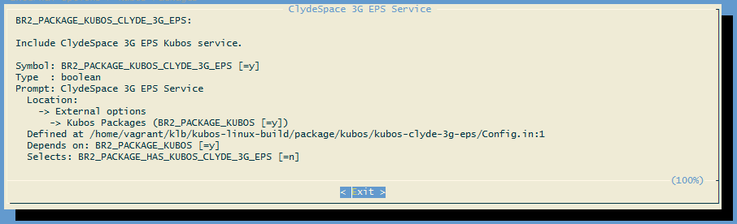

Configuring Kubos Linux
=======================

The default build configurations included in the `kubos-linux-build <https://github.com/kubos/kubos-linux-build/tree/master/configs>`__ repo
will include the :doc:`Kubos core services <../../ecosystem/services/core-services>`, but not any of the available :doc:`hardware services <../../ecosystem/services/hardware-services>`.

As a result, customers will need to manually enable the services and packages corresponding to the devices present in their system.

Additionally, customers may create and include their own :ref:`system packages <custom-packages>`.

Reference Documents
-------------------

- :doc:`kubos-linux-on-bbb`
- :doc:`kubos-linux-on-iobc`
- :doc:`kubos-linux-on-mbm2`
- `Adding New Packages to Buildroot <https://buildroot.org/downloads/manual/manual.html#adding-packages>`__

KubOS Version Selection
-----------------------

By default, each release of Kubos Linux will use the corresponding release of KubOS in the main
`kubos <https://github.com/kubos/kubos>`__ repo.

As a result, if you would like to use the latest code, or version lock on some prior version, the
``BR2_KUBOS_VERSION`` config option should be updated with the desired release number or branch
name.

From the `buildroot-2019.02.2` directory, run ``sudo make menuconfig``. This will bring up the graphical configuration interface.

   Buildroot Configuration Interface
   
Using the down arrow key, navigate to ``External Options``. Press the `Enter` key to enter the sub-menu.
You should see the ``Kubos Packages`` option, which has already been enabled.

From here, press `Enter` to go into the Kubos Packages sub-menu.

The "Kubos Source Version" should be the top field present.
Press the down arrow key and then `Enter` in order to update the field.

Type in the desired version/branch and then press `Enter` to save the change.

Use the right arrow key to select ``<Exit>`` and then press `Enter`.
Repeat this until you are presented with the
`"Do you wish to save your new configuration"` dialog. Press `Enter` to accept the changes.

The new version of KubOS should be automatically built the next time you run ``sudo make``.

Selecting Hardware Services
---------------------------

Once the build environment has been set up, the build target has been set, and, optionally, a full build has been run,
you may edit the build configuration to select additional packages.

From the `buildroot-2019.02.2` directory, run ``sudo make menuconfig``. This will bring up the graphical configuration interface.

   Buildroot Configuration Interface
   
Using the down arrow key, navigate to ``External Options``. Press the `Enter` key to enter the sub-menu.
You should see the ``Kubos Packages`` option, which has already been enabled.

From here, press `Enter` to go into the Kubos Packages sub-menu. You should now see all the Kubos packages which can be enabled.

Using the up/down arrow keys, navigate to the package you would like to include and then press the space bar to enable it.

   Kubos Package Selection
   
You will notice that, once a package is selected, an arrow appears to the right of it. This indicates that a new sub-menu is now available.

If you enter the sub-menu, you will be presented with the options for that particular package.
For most Kubos services, this will be an option which allows you to specify the run level at which the service will be initialized
during system startup, followed by any service-specific configuration values.
For non-boolean options, select the option and then press `Enter` in order to update the field with the desired value.
Press `Enter` again to save the new value and return to the previous menu.

For more information about any of the options in this menu system, navigate to the option and then press `Shift+?`.
This will display the option's help information. Press the `Enter` key to exit.

   Buildroot Option Description
   
To navigate back up the menu tree, use the right arrow key to select ``<Exit>`` and then press `Enter`.

Once you have selected all the desired packages and options, select ``<Exit>`` until you are presented with the
`"Do you wish to save your new configuration"` dialog. Press `Enter` to accept the changes.

Now that configuration is complete, run ``sudo make`` in order to build the newly selected packages.

Saving the Configuration for Re-Use
-----------------------------------

If you would like to save the custom configuration you have created, run ``sudo make savedefconfig``.
This will overwrite the configuration file you intially set for the build. For example, ``kubos-linux-build/config/pumpkin-mbm2_defconfig``.

Going forward, this new file can be fed into any new builds, removing the need to manually select the additional packages.

.. _custom-packages:

Adding Custom Packages
----------------------

While some work has been done by Kubos in order to support :doc:`hardware devices <../../ecosystem/services/hardware-services>`,
it is entirely possible that a customer might want to use a device which is not currently supported.
In this case the customer should write their own support package, and then include it in their Kubos Linux build
using the previous instructions.

The Buildroot manual provides in-depth instructions about `how to create a package <https://buildroot.org/downloads/manual/manual.html#adding-packages>`__.

At a high-level, the instructions are:

- Create a new folder, "your-package", in `kubos-linux-build/packages` containing at least:

    - Config.in - The `KConfig file <https://buildroot.org/downloads/manual/manual.html#writing-rules-config-in>`__ defining ``BR2_PACKAGE_{YOUR_PACKAGE}``,
      along with any additional configuration options
    - {your-package}.mk - The Makefile defining the package and containing the build (``{YOUR_PACKAGE}_BUILD_CMDS``) and installation (``{YOUR_PACKAGE}_INSTALL_TARGET_CMDS``) commands.

- Update `kubos-linux-build/Config.in` to point to your new package's `Config.in` file

Once these changes have been made, you can run ``sudo make menuconfig`` in order to select the new package.

Once selected, you can run ``sudo make`` to do a full build, or ``sudo make {your-package}`` in order to test building only your package.

If you make changes to your package, you can run ``sudo make {your-package}-rebuild`` in order to recompile it.

Configuring Services
--------------------

The Kubos service system relies on a configuration file in `/etc/kubos-config.toml` in order to know which IP ports should be used for which service.
This file is automatically generated during the OS build process, based on the options specified in
the Buildroot configuration file (or updated by the ``sudo make menuconfig`` process).

Users may change these configuration options prior to building their Linux image by running
``sudo make menuconfig``, navigating to the appropriate service package, and then changing the
desired option.

.. note::

    If you would like to change a configuration option after building the Kubos Linux image, you
    should go through the usual change process, then run ``sudo make {package}-reconfigure; sudo make``
    in order to pick up the configuration changes.
    
    For example, if you wanted to change the telemetry database location, you would update the
    ``BR2_KUBOS_CORE_TELEMETRY_DB_DATABASE`` value, then run
    ``sudo make kubos-core-telemetry-db-reconfigure; sudo make``.

More information about service configuration may be found in the :doc:`service config doc <../../ecosystem/services/service-config>`