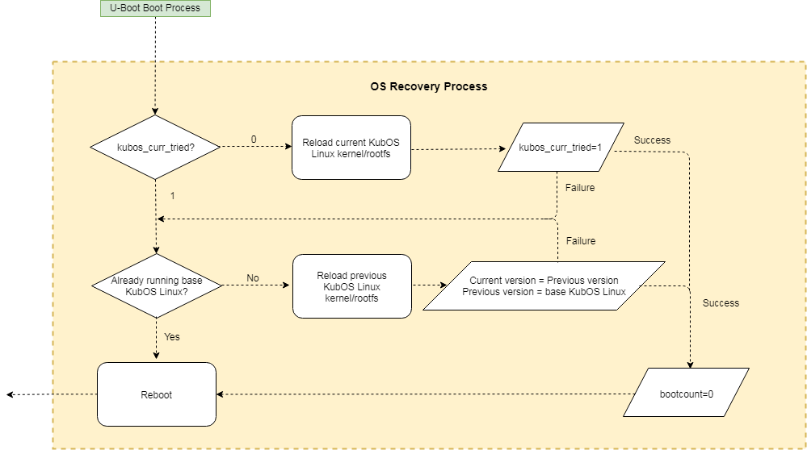

Kubos Linux Recovery Architecture
=================================

Ideally, a space mission using Kubos Linux will run successfully until the end of its natural
lifespan.
However, space is unpredictable and systems can become corrupted. As a result, we've implemented a
basic mechanism to help detect and recover from these random errors.

Overview
--------

Each time the system attempts to boot, an internal counter is increased. On successful boot, a
custom init script will reset this internal counter.

If the system has failed to boot twice already, then the custom Kubos recovery code is attempted.
If the Kubos recovery steps fail, then the system attempts to boot into an alternate operating
system instead.
If that fails, then the system is likely in a non-operational state.
It will enter a state of attempting to boot the alternate OS, failing, then rebooting, to allow for
the chance that a reboot might correct whatever problem has occurred.

If, for some reason, the internal counter cannot be increased, the recovery system simply fails to
take any action.

The recovery system will also be triggered if U-Boot detects that the Kubos Linux kernel file has
become corrupted, no matter what state the boot counter is in.

Environment Variables
---------------------

There are several U-Boot environment variables that are used to track the state of a Kubos Linux
system:

* `bootcmd` - The usual set of commands that are used to boot into Kubos Linux.
* `altbootcmd` - The alternate set of commands that are used if the system cannot successfully boot
  into Kubos Linux. They will be set up to attempt to boot into an alternate OS.
* `recovery_available` - Indicates that recovery actions are available and should be taken, if
  necessary.
* `bootlimit` - The number of bad boots allowed before the system attempts to use altbootcmd instead
  of bootcmd to boot.
* `bootcount` - The number of boots that have been attempted.
* `kubos_curr_version` - The name of the kpack \*.itb file that the current Kubos Linux kernel and
  rootfs were loaded from.
* `kubos_prev_version` - The name of the kpack \*.itb file that was previously used to load the
  Kubos Linux kernel and rootfs.
* `kubos_curr_tried` - Indicates that reloading the current version has been attempted.

The default values for these variables can be found in the configuration header file for each board
located in the `U-Boot repo <https://github.com/kubos/uboot>`__ under the 'include/configs' directory.

Boot Processing Diagram
-----------------------

.. figure:: ../../images/uboot_boot.png
   :alt: Boot Processing Diagram

   Boot Processing Diagram
   
.. figure:: ../../images/kubos_linux_boot.png
   :alt: Linux Boot Verification Diagram
   :scale: 75
   
   Boot Verification Diagram

Kubos Recovery
--------------

The Kubos recovery process has three main components:

* Attempt to reload the current version of Kubos Linux
* Attempt to load the previous version of Kubos Linux
* Attempt to load the base version of Kubos Linux

The boot count will not be increased again until this full recovery process is determined to have
failed.

All of the files required for this process live in the board's 'upgrade' partition.
The base version of Kubos Linux (kpack-base.itb) should be pre-loaded into the partition.
The current and previous versions are loaded into the partition as part of the system upgrade process.
These versions follow a natural process.

Brand new Kubos Linux system:

::

    kubos_curr_version = kpack-base.itb
    kubos_prev_version = kpack-base.itb

After the first system upgrade:

::

    kubos_curr_version = kpack-upgrade1.itb
    kubos_prev_version = kpack-base.itb

After the second system upgrade:

::

    kubos_curr_version = kpack-upgrade2.itb
    kubos_prev_version = kpack-upgrade1.itb

Rolling back to a previous version of Kubos Linux uses the same mechanism as :doc:`upgrading to a new version <kubos-linux-upgrade>`.
A kpack\*.itb file is broken into its components and then the kernel image is written to the boot
partition and the rootfs image is written to the rootfs partition.

.. warning::

    This process will wipe out everything that was previously in the rootfs partition. 
    As a result, all user files should be stored in the user space partition, which is mapped to the '/home' directory. 
    This user space partition should not be affected by the Kubos recovery process.

Manual Recovery
~~~~~~~~~~~~~~~

If for some reason your Kubos Linux system boots after an upgrade but has introduced some
non-critical issue (like an incompatibility with a user application), you can manually rollback to a
previously installed version.
Previous packages are not deleted once they have been loaded.
As a result, you can simply specify which package you would like to boot into and then restart your
system.
List the contents of the '/upgrade' directory to see what files are available.

From the Kubos Linux shell:

::

    $ ls /upgrade
        kpack-2017.02.20.itb    kpack-2017.03.21.itb    kpack-2017.04.11.itb
    $ fw_printenv kubos_updatefile kpack-{desired version}.itb
    $ reboot

Alternate Boot
--------------

If the system has failed to boot more times than the 'bootlimit' value allows, the system will
attempt to boot using the 'altbootcmd' environment variable.
This variable contains all of the commands required to boot into an alternate operating system.
Due to the low-portability of any commands that deal with memory, the exact format will change
between boards (and potentially between missions), but should follow this rough format:

-  Copy the alternate OS from persistent storage into SDRAM.
-  Run the alternate OS from SDRAM.

By default, 'altbootcmd' is setup to simply retry the normal boot commands.
It should be updated once a plan for the secondary boot logic has been established.

Generic Alternate OS Setup
~~~~~~~~~~~~~~~~~~~~~~~~~~

The basic process for creating an alternate OS and loading it onto a board
should be:

* Build an application that is capable of running on the board. Pay attention to the SDRAM address
  that the application is configured to run from. Frequently, this is a static address (likely the
  very beginning of SDRAM), so the application must end up running from this location.
* Load it into the appropriate persistent storage (NOR/NAND flash, SD card, etc)
* Update the altbootcmd variable with the address to copy the application from, the address to copy
  the application to, and the length of the application.
  Then add a command to trigger the boot process. This can be done from the U-Boot CLI with the
  ``setenv`` and ``saveenv`` commands, or from Kubos Linux with the ``fw_setenv`` command.

The updated altbootcmd might look something like this:

::

    altbootcmd=cp.b 0x10080000 0x20000000 0x70000; go 0x20000000

This command will do the following:

  - Copy 0x7000 bytes from address 0x10080000 (a permanent storage location) to address 0x20000000
    (the beginning of SDRAM)
  - Use the ``go`` command to attempt to boot from address 0x20000000 (``go`` is used for generic
    executables)

U-Boot CLI
----------

`U-Boot CLI Documentation <http://www.denx.de/wiki/DULG/UBootCommandLineInterface>`__

The U-Boot CLI provides a few commands which may be helpful for manually diagnosing and recovering
from system problems.
It has a very limited functionality, but should be better than nothing.

If you want to avoid booting into an operating system for any reason and instead want to interact
with the U-Boot CLI, you can abort the boot by creating a serial connection and then holding down
any key while powering the board.
This action will not increase the boot count.
