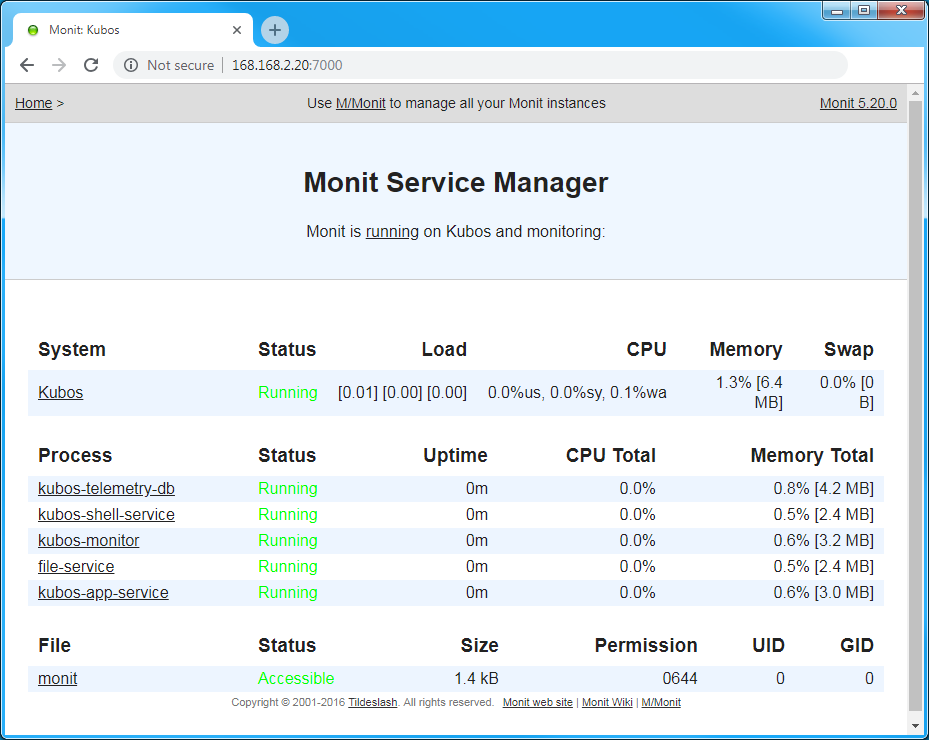

Process Monitoring
==================

KubOS uses `Monit <https://mmonit.com/monit/documentation/monit.html>`__ in order to monitor its
:ref:`services <service-docs>` and other continuous processes.

Monit makes periodic checks to ensure that all defined processes are still running.
If it finds that a process is no longer running, it issues a log message and then attempts to
restart the process.

The default behavior for Monit is defined in ``/etc/monitrc``.

Monit is started as a background daemon during system boot.
The daemon will sleep for 60 seconds between each process-checking cycle.

Monit has its own dedicated log file, ``/var/log/monit.log``.
If and when the log file becomes too large, it will be moved to an archive file using the
:ref:`standard log rotation method <log-rotation>`.

If, for some reason, the Monit daemon process dies, it will automatically be restarted.
This behavior is controlled by the init system and is defined in ``/etc/inittab``.

Monitoring Status
-----------------

The current status of everything Monit is monitoring can be viewed in one of two ways.

First, the information can be viewed by executing ``monit status`` from the OBC's command line.
All status will then be printed to `stdout`.
The output will look something like this::

    Process 'kubos-app-service'
      status                       Running
      monitoring status            Monitored
      monitoring mode              active
      on reboot                    start
      pid                          478
      parent pid                   1
      uid                          0
      effective uid                0
      gid                          0
      uptime                       0m
      threads                      1
      children                     0
      cpu                          0.0%
      cpu total                    0.0%
      memory                       0.6% [3.0 MB]
      memory total                 0.6% [3.0 MB]
      data collected               Thu, 01 Jan 1970 03:13:34
    
    System 'Kubos'
      status                       Running
      monitoring status            Monitored
      monitoring mode              active
      on reboot                    start
      load average                 [0.02] [0.01] [0.00]
      cpu                          0.0%us 0.0%sy 0.0%wa
      memory usage                 6.5 MB [1.3%]
      swap usage                   0 B [0.0%]
      uptime                       -
      boot time                    Thu, 01 Jan 1970 00:00:00
      data collected               Thu, 01 Jan 1970 03:13:34

Alternatively, the status info can be viewed by opening a web browser on a *host machine*
(not the OBC) and opening up a connection to port 7000 on the OBC.
A login dialog will be presented; the login credentials are **kubos/Kubos123**.

This will create a graphical display of the same information returned by ``monit status``:

Configuration
-------------

The items Monit keeps track of are defined in control files.
We have found it easiest to create one file per process which should be monitored.
This keeps configuration more modular and makes it easy to add or remove monitoring for a process.

The files for Kubos-created services are generated automatically during the build process.
For example, `you can see here <https://github.com/kubos/kubos-linux-build/blob/master/package/kubos/kubos-monitor/kubos-monitor.mk>`__
how the monitoring file will be generated for the Kubos monitor service.

Please see the `Monit documentation <https://mmonit.com/monit/documentation/monit.html#THE-MONIT-CONTROL-FILE>`__
for information regarding the syntax of these files.

If Monit's configuration is changed, the ``monit reload`` command can be used in order to make the
Monit daemon re-read its configuration files and process the alterations.

Kubos Service Configuration
~~~~~~~~~~~~~~~~~~~~~~~~~~~

By default, all Kubos services are set up with the following behavior:

- If Monit sees that the service is not running, the service is restarted
- If Monit has already tried to restart the service 3 times within the last 10 minutes, then the
  service is assumed to be bad and is removed from Monit's list of items to monitor
  (this count is reset with a system reboot)

If a service has had to be restarted too many times, the ``status`` and ``monitoring status`` fields
returned by ``monit status`` will both be set to ``unmonitored``.

Additional Configuration Files
~~~~~~~~~~~~~~~~~~~~~~~~~~~~~~

Users may add Monit configurations for their own services and processes in one of two places:

    - ``/etc/monit.d`` - This is the main configuration folder for system-level monitoring.
      Configuration files should be added here for services which exist and operate within the
      root file system.
    - ``/home/system/etc/monit.d`` - This is the secondary configuration folder for user-level
      monitoring. Configuration files should be added here for services or processes which exist
      and operate within the user data partition.