Setting up a Dev Environment in Windows
=======================================

Developing for a Linux-based target system from within a Windows-based host machine is difficult.
The way Windows has architected its file systems and behaviors is fundamentally different from
Linux, making it extremely difficult to run KubOS services and applications locally.

As a result, we recommend that Windows users develop from within a Linux VM.
We provide the Kubos SDK as a pre-built VM which comes with all the tooling needed to create, build,
and run the KubOS components.

This document covers the steps required to set up the Kubos SDK so that it can be used as a
development environment for Windows users.

.. note::

    Microsoft has recently released the Windows Subsystem for Linux on Windows 10.
    It may be possible to set up a development environment using this new utility, however we have
    not currently gone through the effort to figure it out.
    If you happen to get it up and running smoothly, we would love for you to
    :doc:`tell us about it <../contributing/contribution-process>`!

Installing the Kubos SDK
------------------------

Please refer to the :doc:`SDK installation guide <../sdk-docs/sdk-installing>` for information about
installing the Kubos SDK and its dependencies.

Setting up a Shared Folder
--------------------------

It is strongly recommended that you create your projects in a directory on your host machine that is
shared with your SDK instance.
By keeping your project on your host it will protect them in the event your VM is destroyed or
re-built.

Additionally, developing out of a shared folder allows you to use your normal IDE for project
development.
You will just need to execute any commands related to building and running the project from the
SDK's command line.

See the instructions on how to :ref:`mount a host directory <mount-directory>` in your VM for more
information.

Create a Network IP for Your SDK
--------------------------------

We recommend exposing your SDK to your host machine with a private IP address.

See the instructions on how to :ref:`set up a private network address <sdk-port-forward>` in your VM for more
information.

.. _windows-udp:

Allowing UDP Communication
--------------------------

There are certain scenarios where the SDK needs to be able to receive UDP packets from an OBC when
connected via a local ethernet port.
For example, when using the :doc:`file transfer client <../tutorials/file-transfer>`.

In this case, Windows Firewall may need to be updated to allow this traffic.

1. Open 'Windows Firewall with Advanced Security'. You can find this program by opening the start
   menu and searching for "firewall"

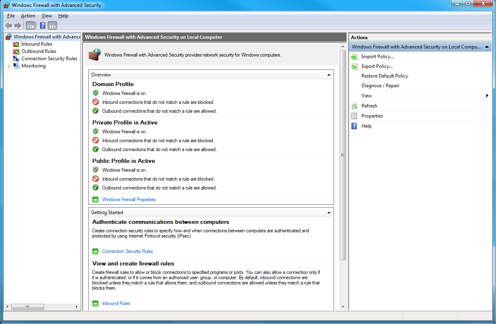

2. Click on "Inbound Rules", then scroll down to the "VBoxHeadless" rules. Find the rule which blocks
   UDP traffic on Public networks.

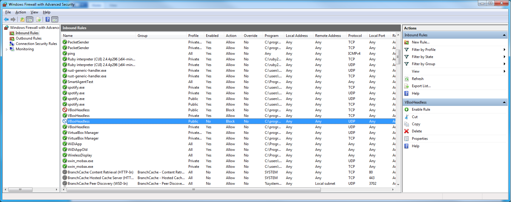

3. Right-click on the rule and select "Disable Rule"

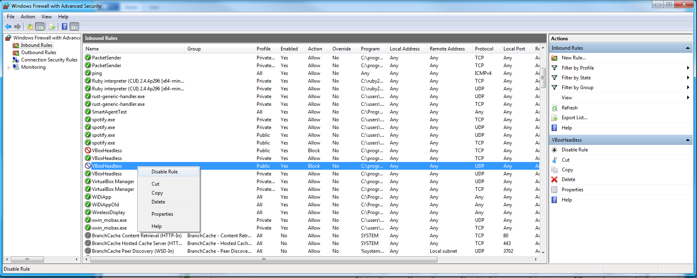

4. Right-click on "Inbound Rules" and select "New Rule"

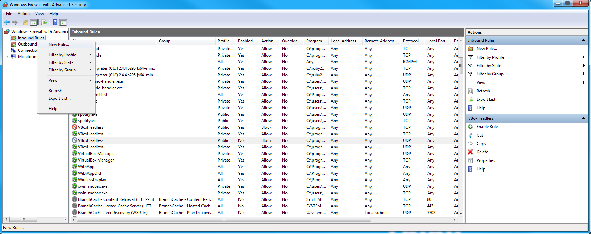

5. Select "Custom" for the type of rule

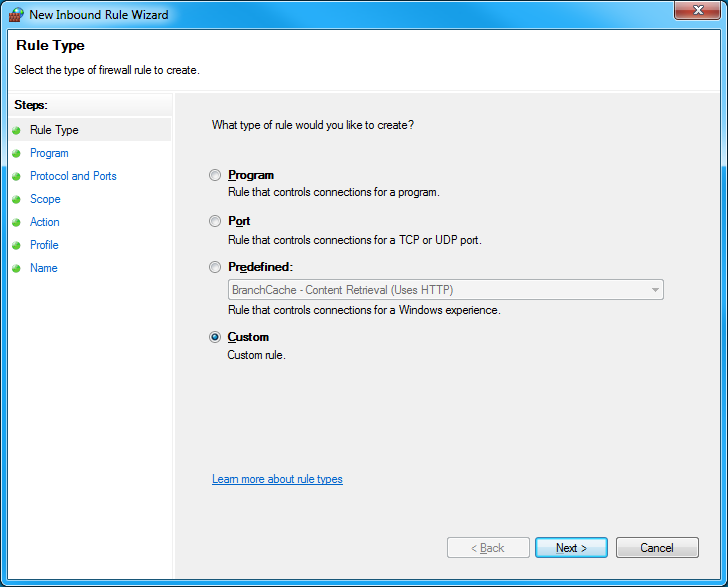

6. Select "All programs"

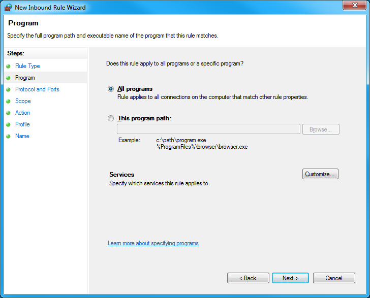

7. Select "UDP" as the protocol type. Leave the "Local port" and "Remote port" settings as "All Ports"

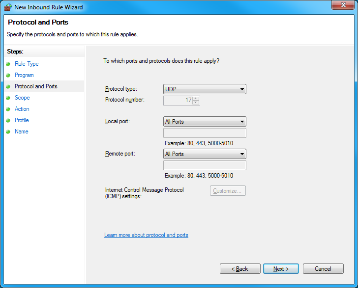

8. Under "Which remote IP addresses does this rule apply to?", click "These IP addresses", then click
   "Add"

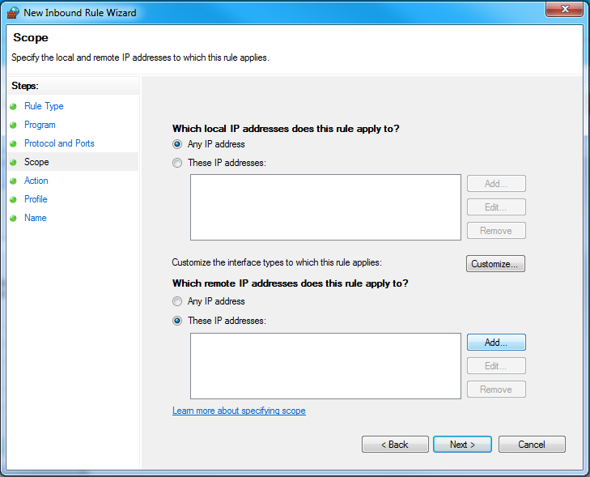

9. In the "This IP address or subnet" field, add the IP address of your OBC, then click "OK", then
   click "Next"

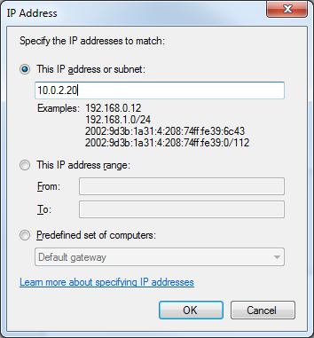

10. Select "Allow the connection"

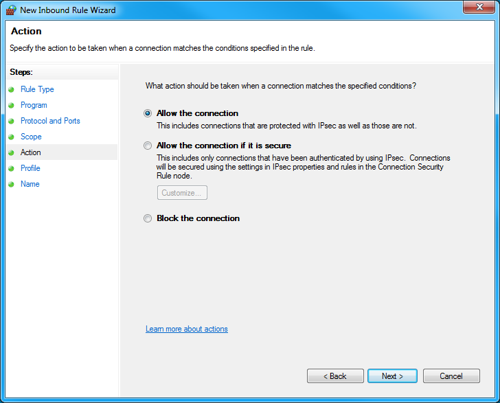

11. In the "When does this rule apply?" menu, leave all checkboxes selected

.. image:: ../images/inbound_rule_network.png

12. In the "Name" field, enter something descriptive for the rule. For example, "Allow UDP from OBC".
    Then click "Finish" to finalize and activate the new rule.

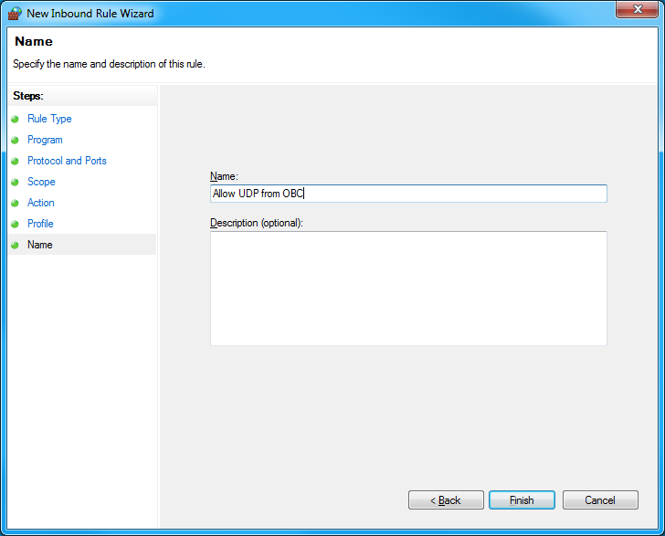

Next Steps
----------

Now that your environment is set up, you can get started developing your first KubOS project.

We recommend that you look at the following documents next:

- :doc:`using-python`
- :doc:`using-rust`
- :doc:`../tutorials/index`