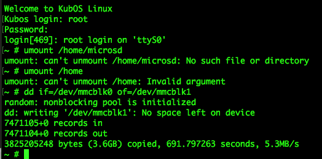
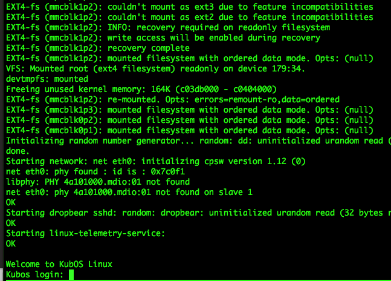

Installing KubOS Linux on a Beaglebone Black
============================================

Overview
--------

This document covers the steps required to install KubOS Linux onto a Beaglebone Black.

Reference Documents
-------------------

Beaglebone Documentation
~~~~~~~~~~~~~~~~~~~~~~~~

- `Beaglebone Black Web Page <https://beagleboard.org/black>`__
- `Beaglebone Black Wiki <http://elinux.org/Beagleboard:BeagleBoneBlack>`__
- `Beaglebone Black Hardware Diagrams <http://beagleboard.org/Support/bone101/#hardware>`__
- `Beaglebone Black System Reference Manual Rev C <http://static6.arrow.com/aropdfconversion/8fff89aa85f5c451318cbdee2facd9c9fac36872/bbb_srm.pdf>`__

Kubos Documentation
~~~~~~~~~~~~~~~~~~~

-  :doc:`../linux-docs/kubos-linux-on-iobc` - Steps to build KubOS Linux for the iOBC
-  :doc:`../linux-docs/first-linux-project` - Basic tutorial for creating your first KubOS
   Linux SDK project
-  :doc:`../sdk-docs/sdk-cheatsheet` - Overview of the common Kubos SDK commands
-  :doc:`../linux-docs/using-kubos-linux` - General guide for interacting with KubOS Linux
-  :doc:`../linux-docs/working-with-the-bbb` - Guide for interacting with BBB-specific features
   
Components
----------

The KubOS Linux installation process is composed of two high-level steps:

  - Flashing the eMMC
  - Flashing the microSD card
    
To perform a full default installation, two files are needed:

  - A KubOS Linux SD card image
  - An aux_sd image
  
All of these files can be obtained from `our KubOS Linux Releases page on GitHub <https://github.com/kubostech/kubos-linux-build/releases>`__

Download the latest `KubOS_Linux.zip` file and then unzip the files for the Beaglebone Black. They're located in the `KubOS_Linux/{version}/Beaglebone-Black` folder.

.. note::

    The Beaglebone Black can also be used as a development board for the Pumpkin MBM2.
    If you would like to use it for this purpose, please follow the
    :doc:`installing-linux-mbm2` instead.

Pre-Requisites
--------------

1. Obtain an SD card that is at least 4GB.

.. note:: 

    The KubOS Linux SD images are created for a 4GB SD card. The image can be applied to a larger SD card, but the
    resulting system will still only have 4GB of space available to it.

 
2. Install `Etcher <https://etcher.io/>`__. Other software to flash SD cards does exist,
   but Etcher is the Kubos software of choice.

3. Obtain the SD card images

Install the eMMC Image
----------------------

Flash the SD Card
~~~~~~~~~~~~~~~~~

Using `Etcher <https://etcher.io/>`__:

  - Select the KubOS Linux image to flash
  - Make sure the SD card device is correct (may be auto-detected if there is only one SD card present
    in your system.)
  - Click the "Flash!" button to start the flashing process
  
.. figure:: ../images/iOBC/etcher.png
   :alt: Etcher Setup

   Etcher Setup
  
It should take roughly 10 minutes for a 4GB image to be loaded onto an SD card.

Once the program has finished successfully, the SD card is ready to be inserted
into the Beaglebone Black's microSD slot.

Boot into U-Boot
~~~~~~~~~~~~~~~~

.. note:: These instructions should work whether you're currently running KubOS Linux
    or some other Linux distribution.

We now want to overwrite the eMMC, so we'll need to use U-Boot in order to boot
KubOS Linux from the SD card.

You'll need to establish a serial connection with the board in order to connect
to the console. 

Hold down any key while the board is booting. This will exit out of the auto-boot and
bring up the CLI.

::

    U-Boot 2016.09 (Jul 17 2017 - 11:43:29 -0500)

    I2C:   ready
    DRAM:  512 MiB
    MMC:   OMAP SD/MMC: 0, OMAP SD/MMC: 1
    Net:   cpsw, usb_ether
    Hit any key to stop autoboot:  0 
    U-Boot>
   
Copy/paste these commands:

::
    
    setenv bootargs console=ttyS0,115200 root=/dev/mmcblk0p2 ext4 rootwait; fatload mmc 0:1 ${fdtaddr} /beaglebone-black.dtb; fatload mmc 0:1 ${loadaddr} /kernel; bootm ${loadaddr} - ${fdtaddr}
    
This will cause the board to load KubOS Linux off of the microSD card, allowing us to flash
the eMMC.

Flash the eMMC
~~~~~~~~~~~~~~

To flash the eMMC, log into the board and then run these commands:

::

    $ umount /home/microsd
    $ umount /home
    $ dd if=/dev/mmcblk0 of=/dev/mmcblk1
    

It is possible that you will see some errors when you try to unmount the directories. 
That's likely not a problem. 
At some point, You may see an informational message, 
``random: nonblocking pool is initialized``. 
This message can be safely ignored.

The four status LEDs on the board should start flashing in a random pattern. 
This indicates that the eMMC is currently being written. 

The process should take roughly ten minutes, after which the LEDs should return to normal, 
with one LED blinking to indicate a successfully running KubOS Linux system.

Then, the system will complain that there is no space left on the device. 
To explain: the eMMC is 4GB, but a small portion is set up as read-only and 
dedicated to boot-time processing. That area means the contents of the 4 GB 
SD card will be larger than the writeable area of the eMMC. The 
``No space left on device`` message will be issued *but is not an error.*

After this has completed, shutdown and de-power the system.

Install the Auxiliary Image
---------------------------

Re-Flash the SD Card
~~~~~~~~~~~~~~~~~~~~

Now flash the micro SD card with the auxiliary SD card image. This image contains the
KubOS Linux upgrade partition and the second user data partition.

Once the flash process has completed, put the card back into the microSD slot
and boot up the system..

.. warning::

    If you do not have a microSD card in the board, the system will not boot.

You will see messages as the data partitions are mounted. For example, 

``EXT4-fs (mmcblk0p2): couldn't mount as ext3 due to feature incompatibilities.``

While they may seem like errors, they are a normal part of the boot process as 
the system detects the partition file type. If there are *actual* issues 
mounting a partition, the resulting error message will look like this: 

``mount: mounting /dev/mmcblk1p3 on /home failed: No such file or directory``

If you see no such errors, the installation process is now complete.

Using KubOS Linux
-----------------

For information on how to create and run applications on your new KubOS Linux system, see the
:doc:`../linux-docs/working-with-the-bbb` guide.
