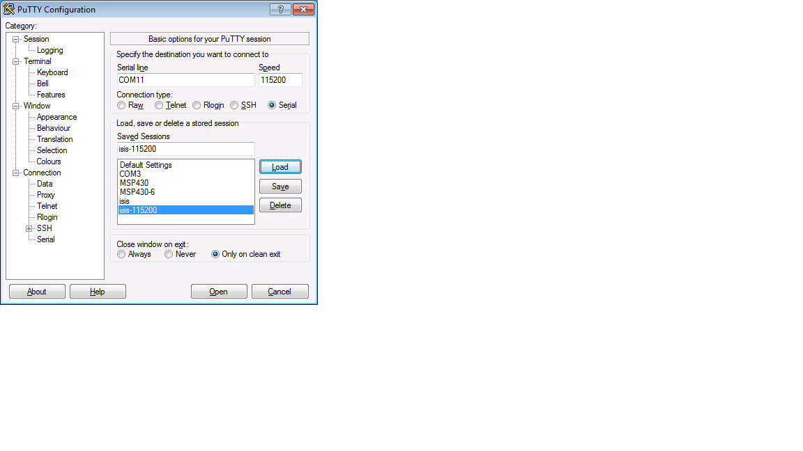
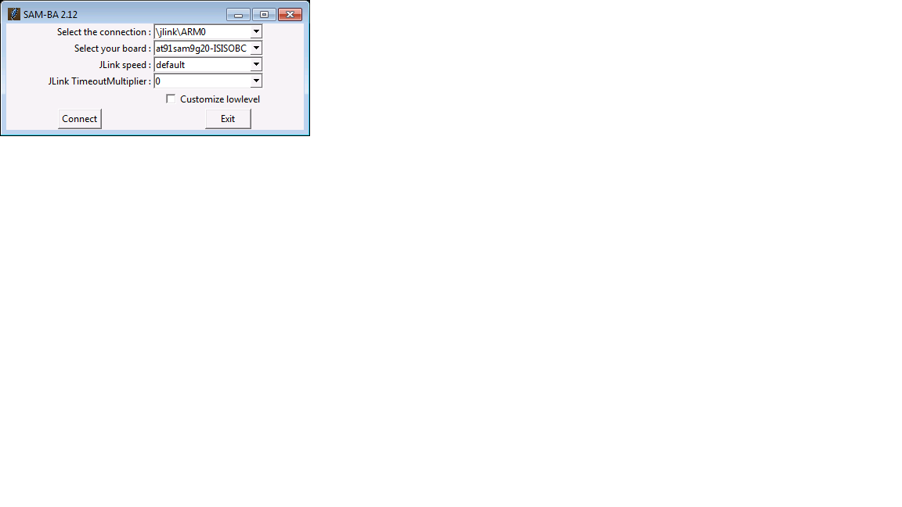
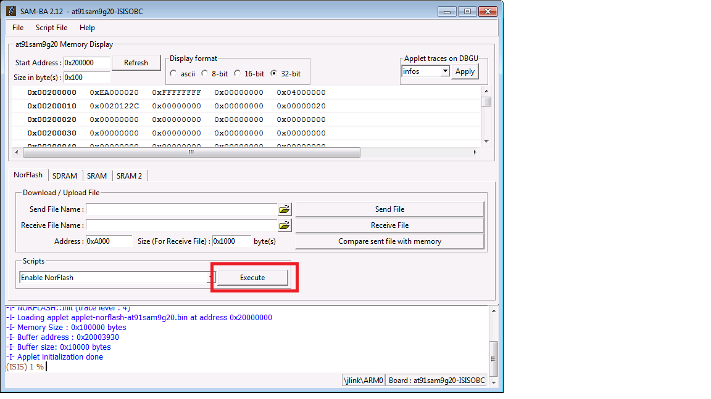
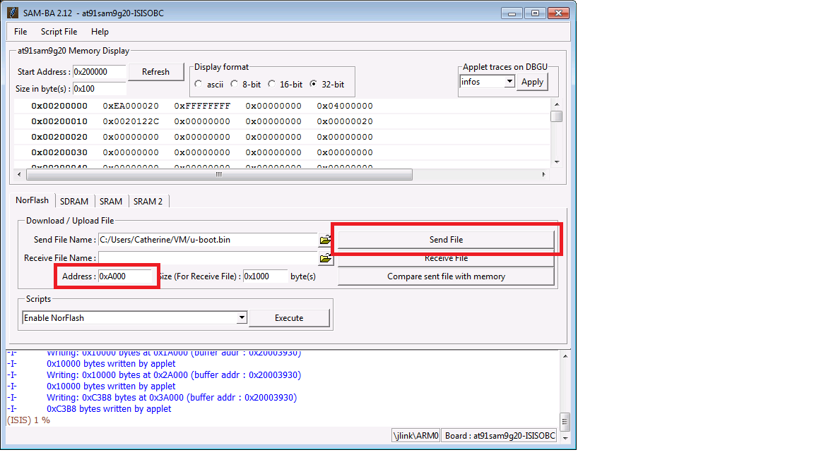

KubOS Linux on the ISIS iOBC
============================

Overview
--------

.. note:: Just looking to install KubOS Linux onto an iOBC? Skip ahead to the :ref:`installation_process`.

The goal of this document is to create a KubOS Linux installation for the iOBC
that can then run the satellite services (telemetry, payload communication,
etc) needed for the ISIS customers' missions.

The :doc:`Working with the iOBC <working-with-the-iobc>` doc can then be used to
create and load a user application on top of the new KubOS Linux install.

Ideally, the user should never have to mess with the kernel themselves. 
It should be pre-loaded onto the iOBC.

Software Components
-------------------

ISIS Bootloader
~~~~~~~~~~~~~~~

The ISIS bootloader lives in the very beginning of the NOR flash. It should come
pre-loaded on the board and should not need to be modified. It initializes the
memory hardware and then copies U-Boot into the SDRAM and starts its execution.

If for some reason this bootloader needs to be reloaded, the relevant
instructions can be found in section 8.1 of the *ISIS-OBC Quickstart Guide*.

U-Boot
~~~~~~

`Wiki <https://en.wikipedia.org/wiki/Das_U-Boot>`__

`Site Page <http://www.denx.de/wiki/U-Boot>`__

`Kubos U-Boot Repo <https://github.com/kubostech/uboot>`__

U-Boot, at the most basic level, is responsible for loading the kernel from the
SD card into the SDRAM. However, it also provides a basic OS and CLI which can
be used to configure and debug the kernel before it's loaded.

Additionally, we've made some changes to allow us to use it as a kernel upgrade
and recovery system. At boot time it will check for available upgrade packages
or a corrupted Linux kernel and will then upgrade or rollback the kernel and
rootfs as necessary.

Kernel
~~~~~~

Linux
^^^^^

`Version Overview <https://kernelnewbies.org/Linux_4.4>`__

We're using Linux 4.4. This is the current long-term support version (LTS) and
will be supported until early 2018.

Glibc
^^^^^

`Overview <https://www.gnu.org/software/libc/>`__

We use the standard GNU C library to build our toolchains. We are currently
building using v2.23.

BusyBox
^^^^^^^

`Overview <https://busybox.net/about.html>`__

BusyBox provides many of the common Linux console and shell commands, but in a
smaller package.

BuildRoot
~~~~~~~~~

`Overview <https://buildroot.uclibc.org/>`__

The current development tool for building all of the components required for
running embedded Linux. Using this allows us to pass in a basic configuration
file and then have all of the required packages and options brought in and
compiled automatically. This reduces the amount of time to configure KubOS
Linux for a new board.

SAM-BA
~~~~~~

`Product Page <http://www.atmel.com/tools/atmelsam-bain-systemprogrammer.aspx>`__

The software tool used to flash the kernel and components onto the iOBC.

.. note:: 

    The ISIS-OBC SDK includes the SAM-BA application. You should install this version,
    rather than the default Atmel version, since it is packaged with several iOBC configuration
    files which are required to successfully connect to the board.

KubOS Linux Build Process
-------------------------

If for some reason you want or need to modify and rebuild the KubOS Linux components, follow
the steps in this section.

.. _build-os:

Build the OS Files
~~~~~~~~~~~~~~~~~~

.. warning::

    The OS files cannot be built using a synced folder in a Vagrant box (or regular VM).
    VirtualBox does not support hard links in shared folders, which are crucial in order to complete
    the build.

Create new folder

::

    $ mkdir kubos-linux

Enter the new folder

::

    $ cd kubos-linux

Download BuildRoot-2016.11 (more current versions of BuildRoot may work as well,
but all testing has been done against 2016.11)

::

    $ wget https://buildroot.uclibc.org/downloads/buildroot-2016.11.tar.gz && tar xvzf buildroot-2016.11.tar.gz && rm buildroot-2016.11.tar.gz

Pull the kubos-linux-build repo

::

    $ git clone http://github.com/kubostech/kubos-linux-build

Move into the buildroot directory

::

    $ cd buildroot-2016.11

Point BuildRoot to the external kubos-linux-build folder and tell it to build
the iOBC.

.. note::

    You will need to build with ``sudo`` if you are using the default iOBC
    configuration, since it points the output toolchain to "/usr/bin/iobc_toolchain",
    which is a protected directory.

::

    $ sudo make BR2_EXTERNAL=../kubos-linux-build at91sam9g20isis_defconfig

Build everything

::

    $ sudo make

The full build process will take a while. Running on a Linux VM, it took about
an hour. Running in native Linux, it took about ten minutes. Once this build
process has completed once, you can run other BuildRoot commands to rebuild
only certain sections and it will go much more quickly (<5 min).

BuildRoot documentation can be found
`**here** <https://buildroot.org/docs.html>`__

The generated files will be located in buildroot-2016.11/output/images. They are:

-  uboot.bin - The U-Boot binary
-  zImage - The compressed Linux kernel file
-  {board}.dtb - The Device Tree Binary that Linux uses to configure itself
   for your board
-  rootfs.tar - The root file system. Contains BusyBox and other libraries

Changing the Output Toolchain Directory
^^^^^^^^^^^^^^^^^^^^^^^^^^^^^^^^^^^^^^^

If you would like to build your toolchain in somewhere other than the
"/usr/bin/iobc_toolchain" directory, update the ``BR2_HOST_DIR`` variable in the
"configs/at91sam9g20isis_defconfig" file.

If you would like BuildRoot to just build the toolchain locally, you may remove
the ``BR2_HOST_DIR`` variable entirely. The toolchain will then be built under the
main "buildroot-2016.11" directory in a new "output/host" folder.

Resetting the Global Links
^^^^^^^^^^^^^^^^^^^^^^^^^^

If you run a full build, the links to all the Kubos SDK modules will be changed to
point at modules within the buildroot directory. As a result, you will be unable
to build any future Kubos SDK projects as a non-privileged user.

To fix this, run these commands:

::

    $ cd $HOME/.kubos/kubos/tools
    $ ./kubos_link.py
    
Depending on the state of your Kubos SDK project, you might also need to change the
module links locally:

::

    $ cd {project folder}
    $ kubos link -a

Create an SD Card Image
~~~~~~~~~~~~~~~~~~~~~~~

.. note::

    The image script will use 4GB of system RAM during execution. By default,
    the Kubos Vagrant box only provides 2GB. As a result, you'll either need to `increase
    the amount of RAM provided to your box 
    <https://askubuntu.com/questions/510134/how-to-increase-vm-hdd-and-ram-sizes>`__,
    or run the script natively.

A script is available to create an SD card image with the latest
KubOS Linux kernel and root filesystem.

Navigate to the 'kubos-linux-build/tools' directory.

Run the ``format-image.sh`` script. You might need to run as root to get
permissions for certain steps.

The script has optional parameters: 

- ``-d {device}`` - Sets the SD card device name to flash the newly created image to
  (does not flash by default)
- ``-i {name}`` - Specifies the output file name of the image file to be created.
  (default: "kubos-linux.img")
- ``-p`` - Specify that existing kpack-base.itb and kernel files should be
  copied into the appropriate partitions 
- ``-pp`` - Specify that the kpack-base.itb and kernel files should be built
  and then copied to their partitions 
- ``-ppp`` - Only build and copy the kpack and kernel files. Skip all other steps. 
- ``-s {size}`` - Size, in MB, of the SD card. The default is 3800 (~4GB). 
- ``-b {branch}`` - Specify the branch name of U-Boot that has been built. The
  default is 'master'. This option should not need to be used outside of
  development.

So if I wanted to create a custom-named image with brand new kernel files,
I would run:

::

    $ ./format-image.sh -i kubos-linux-v1.0.img -pp

Create an Upgrade Package
~~~~~~~~~~~~~~~~~~~~~~~~~

If you would like to distribute your changes as a Kubos upgrade package instead,
please refer to the :ref:`upgrade-creation` instructions.

.. _installation_process:

Installation Process
--------------------

The KubOS Linux installation process is composed of two high-level steps:

  - Flashing the SD card
  - Flashing the on-board NOR flash
    
To perform a default installation, three files are needed:

  - A KubOS Linux SD card image
  - u-boot.bin
  - at91sam9g20isis.dtb
  
All of these files should be obtained from Kubos.

.. todo::

    Add file distribution/aquisition instructions

.. _install-sd:

Install the SD Card Files
~~~~~~~~~~~~~~~~~~~~~~~~~

All users should install the SD card files using a distributed KubOS Linux image, unless they have
created a custom KubOS Linux build. In that case, the SD card files can be installed by either 
flashing a complete KubOS Linux image onto an SD card or by copying the individual files.

Installing the Files From an Image
^^^^^^^^^^^^^^^^^^^^^^^^^^^^^^^^^^

Pre-Requisites
##############

1. Obtain an SD card that is at least 4GB.

.. note:: 

    The KubOS Linux SD images are created for a 4GB SD card. The image can be applied to a larger SD card, but the
    resulting system will still only have 4GB of space available to it.

 
2. Install `Etcher <https://etcher.io/>`__. Other software to flash SD cards does exist,
   but Etcher is the Kubos software of choice.

3. Obtain a KubOS Linux image

Flash the SD Card
#################

Using `Etcher <https://etcher.io/>`__:

  - Select the KubOS Linux image to flash
  - Make sure the SD card device is correct (may be auto-detected if there is only one SD card present
    in your system.)
  - Click the "Flash!" button to start the flashing process
  
.. figure:: images/iOBC/etcher.png
   :alt: Etcher Setup

   Etcher Setup
  
It should take roughly 10 minutes for a 4GB image to be loaded onto an SD card.

Once the program has finished successfully, the SD card is ready to be inserted
into the iOBC's SD Card 0 slot.

Other Installation Methods
^^^^^^^^^^^^^^^^^^^^^^^^^^

If for some reason you do not have a KubOS Linux image, you can load the files onto
an SD card either manually, or by using our flashing script.

Pre-Requisites
##############

In order to write the files to the SD card your build system needs be able to a)
see the SD card device and b) read/write to multiple partitions.

If you're running Mac OS or Windows, you'll need to pass the SD card through to
your Vagrant box.

-  `Mac OS X Instructions <https://www.geekytidbits.com/mount-sd-card-virtualbox-from-mac-osx/>`__
-  `Windows Instructions <http://rizwanansari.net/access-sd-card-on-linux-from-windows-using-virtualbox/>`__

If you're running Linux, you can either pass through the SD card to your Vagrant
box via the VirtualBox Manager, or run the whole build process natively.

Get the Device Name
###################

To start, find the name of your SD card in your system:

::

    $ sudo fdisk -l

You should see a device that looks like this:

::

    Disk /dev/sdb: 3.8 GiB, 4025483264 bytes, 7862272 sectors
    Units: sectors of 1 * 512 = 512 bytes
    Sector size (logical/physical): 512 bytes / 512 bytes
    I/O size (minimum/optimal): 512 bytes / 512 bytes
    Disklabel type: dos
    Disk identifier: 0xf39e6ab1

In this example '/dev/sdb' is the name of the SD card. You might also see
'/dev/mmcblk0'. You'll need to use this name in all future commands.

Run the Formatting/Flashing Script
##################################

A script is available to format the SD card and then load the latest
KubOS Linux kernel and root filesystem.

Navigate to the 'kubos-linux-build/tools' directory.

Run the ``format-sd.sh`` script. You might need to run as root to get
permissions for certain steps.

The script has optional parameters: 

- ``-d {device}`` - Specify the name of the SD card device. The default is
  '/dev/sdb' 
- ``-s {size}`` - Size, in MB, of the SD card. The default is 4000 (4GB). 
- ``-w`` - Specify that the SD card should be wiped before formatting. Useful
  if there was any data previously on the card. **Note** Wiping a 4GB SD card
  takes about 10 minutes. 
- ``-p`` - Specify that existing kpack-base.itb and kernel files should be
  copied into the appropriate partitions 
- ``-pp`` - Specify that the kpack-base.itb and kernel files should be built
  and then copied to their partitions 
- ``-ppp`` - Specify that the SD card should not be formatted. Only build and
  copy the kpack and kernel files. 
- ``-b {branch}`` - Specify the branch name of U-Boot that has been built. The
  default is 'master'. This option should not need to be used outside of
  development.

So if I wanted to wipe my SD card and then build and load the new kernel files,
I would run:

::

    $ ./format-sd.sh -wpp

Once the script has finished successfully, the SD card is ready to be inserted
into the iOBC's SD Card 0 slot.

Manual Format/Flash Process
###########################

If for some reason you'd like to format the SD card and load the bare minimum
files onto it manually, follow this process.

**Partition the SD Card**

First, you'll need to set up the partitions on the SD card (for readability,
we'll be using device name '/dev/sdb'. Be sure to replace with the device name
of your SD card):

Create a partition table

::

    $ sudo parted /dev/sdb mklabel msdos y

Create the partitions

::

    $ sudo parted /dev/sdb mkpart primary ext4 1M 3917M
    $ sudo parted /dev/sdb mkpart extended 3917M 4000M
    $ sudo parted /dev/sdb mkpart logical fat16 3917M 3938M
    $ sudo parted /dev/sdb mkpart logical ext4 3938M 3949M
    $ sudo parted /dev/sdb mkpart logical ext4 3949M 4000M

Configure the partitions (ex. /dev/sdb1)

::

    $ sudo mkfs.ext4 /dev/sdb1
    $ sudo mkfs.fat /dev/sdb5
    $ sudo mkfs.ext4 /dev/sdb6
    $ sudo mkfs.ext4 /dev/sdb7

**Create the Kernel File**

The BuildRoot build process creates the zImage file, which is a self-extracting
kernel image. In order to help detect corruption, we package that into an
\*.itb file, which includes a checksum value that can be validated during boot time.

Navigate to your 'kubos-linux-build' folder and open the 'tools' directory.

Run the ``kubos-kernel.sh`` script.

The script has optional parameters (which are unlikely to be needed): 

- ``-i {input-file}`` - Specify the name of the
  \*.its file to use. This file describes the files that will be packaged and their usage configuration options. The default is 'kubos-kernel.its', which should also be located in the 'tools' directory. 
-  ``-b {branch}`` - Specify the branch name of U-Boot that has been built.
   The default is 'master'. This option should not need to be used outside of
   development. 

The script will create the 'kubos-kernel.itb' file.

**Copy the files**

Next, you'll need to copy the kernel file into the boot partition and the rootfs
into the rootfs partition

From your project folder:

Create mount folders

::

    $ mkdir boot
    $ mkdir rootfs

Mount the partitions (replace '/dev/sdb' with the name of your SD card device)

::

    $ sudo mount /dev/sdb5 boot
    $ sudo mount /dev/sdb6 rootfs

Copy the kubos-kernel.itb file into partition 5. It will need to be renamed to
'kernel'.

::

    $ sudo cp buildroot-2016.11/output/images/kubos-kernel.itb boot/kernel

Untar the rootfs into partition 6

::

    $ sudo tar -xvf buildroot-2016.11/output/images/rootfs.tar -C rootfs

Unmount the partitions

::

    $ sudo umount /dev/sdb5
    $ sudo umount /dev/sdb6

Remove the SD card and insert it into iOBC SD card slot 0.

Install the NOR Flash Files
~~~~~~~~~~~~~~~~~~~~~~~~~~~

The NOR flash files will be loaded onto the iOBC using the Atmel SAM-BA software.

This can be done using the SAM-BA GUI or by using a command line script.

The SD card does not need to be inserted into the iOBC in order for this step to work.

.. warning::

    **The SAM-BA software currently only supports using the SAM-ICE JTAG with host machines
    running Windows. This means that you must use a Windows OS in order to initially flash
    the iOBC.**
    
    Once KubOS Linux has been installed, the device tree, which is located in the NOR flash,
    can be updated using the standard :ref:`upgrade-installation` process with a `kpack-nor-*.itb`
    file.

Pre-Requisites
^^^^^^^^^^^^^^

1. Obtain an `Atmel SAM-ICE programmer/debugger <http://www.atmel.com/tools/atmelsam-ice.aspx>`__.
2. Install programming drivers from https://www.segger.com/jlink-software.html.
3. Install FTDI USB-to-serial drivers from http://www.ftdichip.com/Drivers/VCP.htm
4. Install SAM-BA from the ISIS-OBC SDK installer. 
   (Refer to Section 3.3 of the `ISIS-OBC Quick Start Guide`)
   
   **Note:** You must use the ISIS version of SAM-BA, rather than the default
   Atmel installation. It includes several configuration files that are required
   to connect to the iOBC.
5. Setup the iOBC board for serial connection and programming. (Refer to
   Chapter 4 of the `ISIS-OBC Quick Start Guide`)
6. Connect the programming and serial connection cables to your
   computer.
7. Power the board.

.. warning::

    Make sure the red jumper on the programming board is in place; it bypasses
    the watchdog. If you don't, the board will continually reboot and you won't be
    able to flash anything.

**If you are using the command line script, follow these additional steps:**

1. Copy the `kubos-nor-flash.tcl` script from the `tools/at91sam9g20isis` folder in
   the `kubos-linux-build <https://github.com/kubostech/kubos-linux-build>`__ repo
   into the SAM-BA application folder.
2. Update the `{path to SAM-BA}/tcl_lib/boards.tcl` file to change this line:

   ``"at91sam9g20-ISISOBC"    "at91sam9g20-ISISOBC/at91sam9g20-ISISOBC.tcl"``
   
   to this:
   
   ``"at91sam9g20-isisobc"    "at91sam9g20-ISISOBC/at91sam9g20-ISISOBC.tcl"``
   
   (the command line converts everything to lower case, which will lead to 
   a "board not found" error if you don't change this file)

Boot into U-Boot (Optional)
^^^^^^^^^^^^^^^^^^^^^^^^^^^

(Skip this section if you've never put Linux on your board before)

If you already have Linux running on your board, you'll need to boot into the
U-Boot console rather than the Linux console in order to be able to flash the
board.

You'll need to establish a serial connection with the board in order to connect
to the console. Set up a serial connection to the board at a baudrate of 115200.

   PuTTY Connection

Once the serial connection is open, boot (or reboot) the board. Hold down any
key while the board is starting up. This will exit out of the auto-boot and
bring up the CLI.

.. figure:: images/iOBC/uboot_console.png
   :alt: U-Boot Console

   U-Boot Console

Flash the Files
^^^^^^^^^^^^^^^

Using the Script
################

The flashing script can be called from the standard command prompt using this command:

::

    $ {path to SAM-BA}/sam-ba.exe \jlink\ARM0 at91sam9g20-ISISOBC
          {path to SAM-BA}/kubos-nor-flash.tcl {input arguments} [> {logfile}]
    
Where the input arguments are as follows:

  - uboot={uboot file} - Path to U-Boot binary
  - dtb={dtb file} - Path to Device Tree binary
  - altos={alt file} - Path to alternate OS binary
  
Multiple input arguments can be specified and should be space-separated.
  
The optional logfile parameter is highly recommended, as the SAM-BA application will not
give any other response to this command. The log file will contain all of the output as the 
script connects to the board and transfers the files.

Example command:

::

    $ C:/ISIS/applications/samba/sam-ba.exe /jlink/ARM0 at91sam9g20-ISISOBC 
          kubos-nor-flash.tcl uboot=new-u-boot.bin dtb=new-dtb.dtb 
          > logfile.log
 
If you'd like to confirm that the command ran successfully, open the log file. You should see
this message for each file you attempted to flash:

    ``Sent file & Memory area content (address: [...], size: [...] bytes) match exactly !``

Using the SAM-BA GUI
####################

Start SAM-BA
************

Start up SAM-BA. You'll want to select the at91sam9g20-ISISOBC option from the
'Select your board' drop-down.

   SAM-BA Connection Selection

Enable Flashing
***************

Execute the 'Enable NorFlash' script. This will prep the board to enable
flashing.

   SAM-BA Enable NorFlash

Flash U-Boot
************

Select the uboot.bin file in the 'Send File Name' field.

Make sure that 'Address' is set to 0xA000.

Click 'Send File'

   SAM-BA Send U-Boot
   
Click 'Compare sent file with memory' after the file transfer has completed to confirm
that all data was sent successfully.

Flash Device Tree
*****************

Select the at91sam9g20isis.dtb file in the 'Send File Name' field (you'll need
to view all file types in order to see the .dtb file)

Set 'Address' to 0x70000.

Click 'Send File'

.. figure:: images/iOBC/samba_send_dtb.png
   :alt: SAM-BA Send DTB

   SAM-BA Send DTB
   
Click 'Compare sent file with memory' after the file transfer has completed to confirm
that all data was sent successfully.

Reboot the System
~~~~~~~~~~~~~~~~~

If you have not already done so, insert the SD card into the iOBC's first SD card
slot while the board is not powered.

After new files have been loaded, the board will need to be powered off and back
on again in order to go through the normal boot process.

Status LEDs
-----------

There are four yellow LEDs present on the iOBC which give some indication of what state
the board is in, along with one red LED which is lit when the system is powered:

-  Three LEDS (solid) - The system is currently running U-Boot
-  One LED (blinking) - The system is currently running KubOS Linux

Connect to the System
---------------------

You should now be able to set up a serial connection to your board and interact
with the KubOS Linux environment.

You'll need to establish a serial connection with the board in order to connect
to the console. Set up a serial connection to the board at a baudrate of 115200.

If you have a Kubos Vagrant image currently running, the FTDI connection will
be automatically passed through. You can use the included minicom configuration
to quickly connect to the iOBC via the ``minicom kubos`` command in the VM's
command console.

.. note:: 

    If a Kubos Vagrant image is running, you will be unable to establish a serial
    connection on your host machine. You must instead connect to the device 
    through the VM.

::

    $ minicom kubos
    
If the board is already powered, hit the ``Enter`` key to display the login dialog.

If you power the board after starting the minicom session, the end of the boot
messages will look like this:

::

    ...
    EXT4-fs (mmcblk0p1): mounted filesystem with ordered data mode. Opts: (null)
    EXT4-fs (mmcblk0p7): recovery complete
    EXT4-fs (mmcblk0p7): mounted filesystem with ordered data mode. Opts: (null)
    Initializing random number generator... random: dd: uninitialized urandom read (512 bytes read, 25 bits of entropy available)
    done.
    Starting network: OK
    Starting kubos-c2-daemon:
    OK
    Starting linux-telemetry-service:
    OK
    
    Welcome to KubOS Linux
    Kubos login: 
    
By default, there are two user accounts available: "root" (the superuser), and "kubos" (a normal user).
Both have a default password of "Kubos123". For more information, see the :ref:`user-accounts` section.

Upgrade Process
---------------

If you already have KubOS Linux installed on your system, but would like to
upgrade to the latest version, check out the :ref:`upgrade-installation` section. 
Alternatively, if you would like to rollback to a previously installed version, 
refer to the :ref:`upgrade-rollback` section.

Recovery Process
----------------

Should your KubOS Linux kernel become corrupted (as indicated by failing to
successfully boot into Linux several times), the system will automatically try
to recover during the next boot.

It will go through the following steps, if each is present (system will reboot
after attempting each step):

1. Reload the current version of KubOS Linux from the kpack\*.itb file
   in the upgrade partition
2. Reload the previous version of KubOS Linux from the kpack\*.itb file
   in the upgrade partition
3. Reload the base version of KubOS Linux from the kpack-base.itb file
   in the upgrade partition
4. Boot into the alternate OS

If none of these steps work, then the system will boot into the U-Boot CLI. From
here, some basic troubleshooting and debugging abilities should be available.

More information about the recovery process and architecture can be found in the
:doc:`KubOS Linux Recovery doc <kubos-linux-recovery>`

Resetting the Environment
-------------------------

If the system goes through the full recovery process, you will need to reset the environment
in order to resume the normal boot process.

From the U-Boot CLI:

::

    $ env default bootcmd
    $ env default bootcount
    $ env default recovery_available
    $ saveenv
    $ reset
    
These commands will:

  - Restore the relevant environment variables to their default values
  - Save the new values to persistent storage
  - Reboot the system
  
As long as a valid kernel and rootfs are available, your system should now successfully boot
into KubOS Linux.

Using KubOS Linux
-----------------

For information on how to create and run applications on your new KubOS Linux system, see the
:doc:`working-with-the-iobc` guide.
