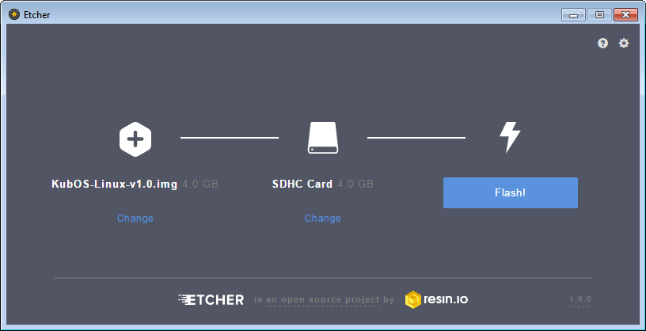
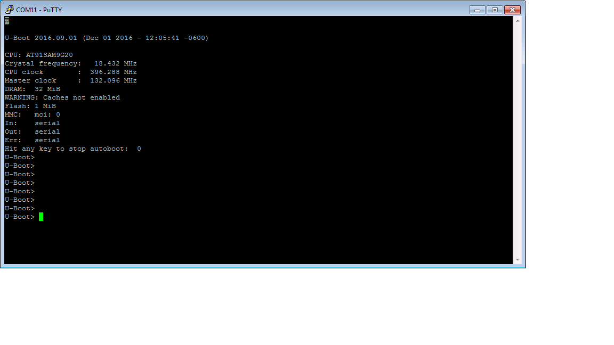

KubOS Linux on the Pumpkin MBM2
===============================

Overview
--------

.. note:: Just looking to install KubOS Linux onto a Pumpkin MBM2? Skip ahead to the :ref:`installation-process-mbm2`.

The goal of this document is to create a KubOS Linux installation for the Pumpkin
Motherboard Module 2 that can then run the satellite services (telemetry, payload 
communication, etc) needed for the Pumpkin customers' missions.

The :doc:`Working with the Pumpkin MBM2 <working-with-the-mbm2>` doc can then be used to
create and load a user application on top of the new KubOS Linux install.

Ideally, the user should never have to mess with the kernel. 
It should be pre-loaded onto the Pumpkin MBM2.

Software Components
-------------------

ROM Bootloader
~~~~~~~~~~~~~~

The ROM bootloader lives in a small section of ROM space. It should come
pre-loaded on the board and should not need to be modified. It selects the
next bootloader depending on whether the boot mode button is being held.
If not held, it attempts to run the next boot step from eMMC storage; 
otherwise, it attempts to boot from the microSD card.

U-Boot
~~~~~~

`Wiki <https://en.wikipedia.org/wiki/Das_U-Boot>`__

`Site Page <http://www.denx.de/wiki/U-Boot>`__

`Kubos U-Boot Repo <https://github.com/kubostech/uboot>`__

U-Boot, at the most basic level, is responsible for loading the kernel from the
SD card into the SDRAM. However, it also provides a basic OS and CLI which can
be used to configure and debug the kernel before it's loaded.

Additionally, we've made some changes to allow us to use it as a kernel upgrade
and recovery system. At boot time it will check for available upgrade packages
or a corrupted Linux kernel and will then upgrade or rollback the kernel and
rootfs as necessary.

This board utilizes U-Boot's SPL feature. A small boot file called "MLO" is
run and that file then loads the main U-Boot image into SDRAM.

Kernel
~~~~~~

Linux
^^^^^

`Version Overview <https://kernelnewbies.org/Linux_4.4>`__

We're using Linux 4.4. This is the current long-term support version (LTS) and
will be supported until early 2018.

Glibc
^^^^^

`Overview <https://www.gnu.org/software/libc/>`__

We use the standard GNU C library to build our toolchains. We are currently
building using v2.23.

BusyBox
^^^^^^^

`Overview <https://busybox.net/about.html>`__

BusyBox provides many of the common Linux console and shell commands, but in a
smaller package.

BuildRoot
~~~~~~~~~

`Overview <https://buildroot.uclibc.org/>`__

The current development tool for building all of the components required for
running embedded Linux. Using this allows us to pass in a basic configuration
file and then have all of the required packages and options brought in and
compiled automatically. This reduces the amount of time to configure KubOS
Linux for a new board.

KubOS Linux Build Process
-------------------------

If for some reason you want or need to modify and rebuild the KubOS Linux components, follow
the steps in this section.

.. _build-os-mbm2:

Build the OS Files
~~~~~~~~~~~~~~~~~~

.. warning::

    The OS files cannot be built using a `synced folder <https://www.vagrantup.com/docs/synced-folders/>`__ in a Vagrant box (or regular VM).
    VirtualBox does not support hard links in shared folders, which are crucial in order to complete
    the build.

Create new folder

::

    $ mkdir kubos-linux

Enter the new folder

::

    $ cd kubos-linux

Download BuildRoot-2016.11 (more current versions of BuildRoot may work as well,
but all testing has been done against 2016.11)

::

    $ wget https://buildroot.uclibc.org/downloads/buildroot-2016.11.tar.gz && tar xvzf buildroot-2016.11.tar.gz && rm buildroot-2016.11.tar.gz

Pull the kubos-linux-build repo

::

    $ git clone http://github.com/kubostech/kubos-linux-build

Move into the buildroot directory

::

    $ cd buildroot-2016.11

Point BuildRoot to the external kubos-linux-build folder and tell it to build
for the Pumpkin MBM2.

.. note::

    You will need to build with ``sudo`` if you are using the default 
    configuration, since it points the output toolchain to "/usr/bin/bbb_toolchain",
    which is a protected directory.

::

    $ sudo make BR2_EXTERNAL=../kubos-linux-build pumpkin-mbm2_defconfig

Build everything

::

    $ sudo make

The full build process will take a while. Running on a Linux VM, it takes about
an hour. Running in native Linux, it took about ten minutes. Once this build
process has completed once, you can run other BuildRoot commands to rebuild
only certain sections and it will go much more quickly (<5 min).

BuildRoot documentation can be found
`**here** <https://buildroot.org/docs.html>`__

The generated files will be located in buildroot-2016.11/output/images.
The relevant files are:

-  uboot.bin - The U-Boot binary
-  kernel - The compressed Linux kernel file
-  pumpkin-mbm2.dtb - The Device Tree Binary that Linux uses to configure itself
   for the Pumpkin MBM2 board
-  rootfs.tar - The root file system. Contains BusyBox and other libraries
-  kubos-linux.img - The complete KubOS Linux SD card image

Changing the Output Toolchain Directory (optional)
^^^^^^^^^^^^^^^^^^^^^^^^^^^^^^^^^^^^^^^^^^^^^^^^^^

If you would like to build your toolchain in somewhere other than the
"/usr/bin/pumpkin-mbm2_toolchain" directory, update the ``BR2_HOST_DIR`` variable in the
"configs/pumpkin-mbm2_defconfig" file.

If you would like BuildRoot to just build the toolchain locally, you may remove
the ``BR2_HOST_DIR`` variable entirely. The toolchain will then be built under the
main "buildroot-2016.11" directory in a new "output/host" folder.

Create auxilliary SD Card Image
~~~~~~~~~~~~~~~~~~~~~~~~~~~~~~~

By default, the build process will create a bootable SD card image. This will be flashed
onto the eMMC. In order to create a full KubOS Linux setup, you'll want to also create
an auxiliary image for the microSD card containing the upgrade partition and an additional
user data partition.

Follow the :ref:`upgrade-creation` instructions in order to create a Kubos Package file
(kpack-*.itb) to be used for recovery.

Then, from the `kubos-linux-build/tools` folder, run the ``format-aux.img`` script. 
This will create a new SD card image, `aux-sd.img`, with two partitions:
- An upgrade partition containing `kpack-base.itb`
- A user data partition

There are two parameters which may be specified:

-  -s : Sets the size of the aux-sd.img file, specified in MB. The default is 3800 (3.8GB)
-  -i : Specifies the name and location of the kpack-*.itb file to use as kpack-base.itb

For example:

::

    $ ./format-aux.sh -i ../kpack-2017.07.21.itb

Reset the Global Links
~~~~~~~~~~~~~~~~~~~~~~

If you run a full build, the links to all the Kubos SDK modules will be changed to
point at modules within the buildroot directory. As a result, you will be unable
to build any future Kubos SDK projects as a non-privileged user.

To fix this, run these commands:

::

    $ cd $HOME/.kubos/kubos/tools
    $ ./kubos_link.py
    
Depending on the state of your Kubos SDK project, you might also need to change the
module links locally:

::

    $ cd {project folder}
    $ kubos link -a

.. _installation-process-mbm2:

Default Installation Process
----------------------------

The KubOS Linux installation process is composed of two high-level steps:

  - Flashing the eMMC
  - Flashing the microSD card
    
To perform a full default installation, two files are needed:

  - A KubOS Linux SD card image
  - An aux_sd1 image
  
All of these files can be obtained from `our KubOS Linux Releases page on GitHub <https://github.com/kubostech/kubos-linux-build/releases>`__

Download the latest `KubOS_Linux.zip` file and then unzip the files for the Pumpkin MBM2. They're located in the `KubOS_Linux/{version}/Pumpin-MBM2` folder.

Pre-Requisites
~~~~~~~~~~~~~~

1. Obtain an SD card that is at least 4GB.

.. note:: 

    The KubOS Linux SD images are created for a 4GB SD card. The image can be applied to a larger SD card, but the
    resulting system will still only have 4GB of space available to it.

 
2. Install `Etcher <https://etcher.io/>`__. Other software to flash SD cards does exist,
   but Etcher is the Kubos software of choice.

3. Obtain the SD card images

Install the eMMC Image
~~~~~~~~~~~~~~~~~~~~~~

Flash the SD Card
^^^^^^^^^^^^^^^^^

Using `Etcher <https://etcher.io/>`__:

  - Select the KubOS Linux image to flash
  - Make sure the SD card device is correct (may be auto-detected if there is only one SD card present
    in your system.)
  - Click the "Flash!" button to start the flashing process
  

   Etcher Setup
  
It should take roughly 10 minutes for a 4GB image to be loaded onto an SD card.

Once the program has finished successfully, the SD card is ready to be inserted
into the Pumpkin MBM2's microSD slot.

Boot into U-Boot
^^^^^^^^^^^^^^^^

KubOS Linux normally runs on the eMMC. Since we now want to overwrite the eMMC,
we'll need to change some settings to boot from the SD card instead.

You'll need to establish a serial connection with the board in order to connect
to the console. 

You can do this via a Kubos Vagrant image with the ``minicom kubos`` command
after booting the board.

The default login account is kubos/Kubos123.

Issue the ``reboot`` command in order to restart the system.

Hold down any key while the board is restarting. This will exit out of the auto-boot and
bring up the CLI.

   U-Boot Console
   
Run these commands:

::
    
    U-Boot> setenv boot_dev 0
    U-Boot> run bootcmd
    
This will cause the board to load KubOS Linux off of the microSD card, allowing us to flash
the eMMC.

Flash the eMMC
^^^^^^^^^^^^^^

To flash the eMMC, log into the board and then run these commands:

::
    $ umount /dev/mmcblk1p3
    $ dd if=/dev/mmcblk0 of=/dev/mmcblk1
    
The four status LEDs on the board should start flashing in a random pattern. This indicates
that the eMMC is currently being flashed. 

The process should take roughly ten minutes, after which the LEDs should return to normal, 
with one LED blinking to indicate a successfully running KubOS Linux system.

After this has completed, shutdown and de-power the system.

Install the Auxiliary Image
~~~~~~~~~~~~~~~~~~~~~~~~~~~

Re-Flash the SD Card
^^^^^^^^^^^^^^^^^^^^

Now flash the micro SD card with the auxiliary SD card image. This image contains the
KubOS Linux upgrade partition and the second user data partition.

Once the flash process has completed, put the card back into the microSD slot.

The installation process is now complete.

Status LEDs
-----------

There are four LEDs present on the Pumpkin MBM2 which give some indication of what state
the board is in. When there is only one blinking LED, the board is running KubOS Linux and
the system is currently idle. The LEDs will blink in correspondence with CPU and MMC activity.
If all LEDs are solid, then the system has reached some kind of locked error state.

Connect to the System
---------------------

You should now be able to set up a serial connection to your board and interact
with the KubOS Linux environment.

You'll need to establish a serial connection with the board in order to connect
to the console. Set up a serial connection to the board at a baudrate of 115200.

If you have a Kubos Vagrant image currently running, the FTDI connection will
be automatically passed through. You can use the included minicom configuration
to quickly connect to the board via the ``minicom kubos`` command in the VM's
command console.

.. note:: 

    If a Kubos Vagrant image is running, you will be unable to establish a serial
    connection on your host machine. You must instead connect to the device 
    through the VM.

::

    $ minicom kubos
    
If the board is already powered, hit the ``Enter`` key to display the login dialog.

If you power the board after starting the minicom session, the end of the boot
messages will look like this:

::

    ...
    Freeing unused kernel memory: 172K (c0401000 - c042c000)
    EXT4-fs (mmcblk1p2): re-mounted. Opts: errors=remount-ro,data=ordered
    EXT4-fs (mmcblk1p3): mounted filesystem with ordered data mode. Opts: (null)
    EXT4-fs (mmcblk0p1): mounted filesystem with ordered data mode. Opts: (null)
    Initializing random number generator... random: dd: uninitialized urandom read (512 bytes read, 12 bits of entropy available)
    done.
    Starting network: OK
    Starting kubos-c2-daemon:
    OK
    Starting linux-telemetry-service:
    OK
    
    Welcome to KubOS Linux
    Kubos login: 
    
By default, there are two user accounts available: "root" (the superuser), and "kubos" (a normal user).
Both have a default password of "Kubos123". For more information, see the :ref:`user-accounts` section.

Using KubOS Linux
-----------------

For information on how to create and run applications on your new KubOS Linux system, see the
:doc:`working-with-the-mbm2` guide.

Upgrade Process
---------------

If you already have KubOS Linux installed on your system, but would like to
upgrade to the latest version, check out the :ref:`upgrade-installation` section. 
Alternatively, if you would like to rollback to a previously installed version, 
refer to the :ref:`upgrade-rollback` section.

Recovery Process
----------------

Should your KubOS Linux kernel become corrupted (as indicated by failing to
successfully boot into Linux several times), the system will automatically try
to recover during the next boot.

It will go through the following steps, if each is present (system will reboot
after attempting each step):

1. Reload the current version of KubOS Linux from the kpack\*.itb file
   in the upgrade partition
2. Reload the previous version of KubOS Linux from the kpack\*.itb file
   in the upgrade partition
3. Reload the base version of KubOS Linux from the kpack-base.itb file
   in the upgrade partition
4. Boot into the alternate OS

If none of these steps work, then the system will boot into the U-Boot CLI. From
here, some basic troubleshooting and debugging abilities should be available.

More information about the recovery process and architecture can be found in the
:doc:`KubOS Linux Recovery doc <kubos-linux-recovery>`

Resetting the Environment
-------------------------

If the system goes through the full recovery process, you will need to reset the environment
in order to resume the normal boot process.

From the U-Boot CLI:

::

    $ env default bootcmd
    $ env default bootcount
    $ env default recovery_available
    $ saveenv
    $ reset
    
These commands will:

  - Restore the relevant environment variables to their default values
  - Save the new values to persistent storage
  - Reboot the system
  
As long as a valid kernel and rootfs are available, your system should now successfully boot
into KubOS Linux.