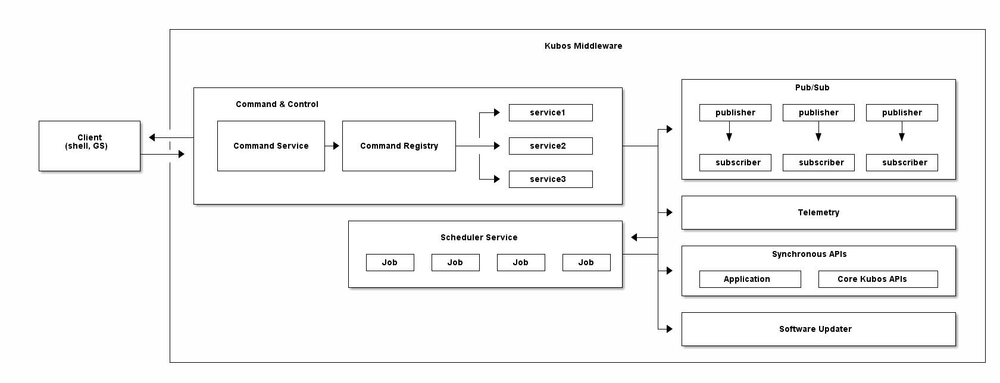

Kubos Middleware
================

   
.. todo:: Update all of this once the new architecture is done

The Kubos middleware sits on top of the desired operating system.
Its goal is to simplify and automate intra-system processes, making
writing and interacting with mission components as painless as
possible.

.. warning::
	This functionality is still heavily under development.
	Not all features may be available for all targets.

.. toctree::
    :hidden:
    
    Command and Control <command-and-control>