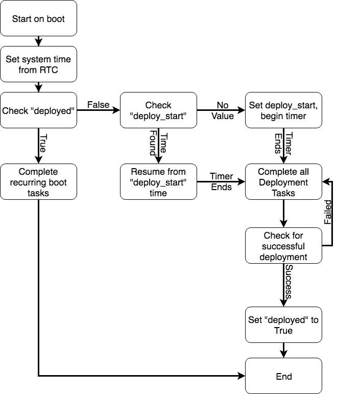

Deployment Application Guide
============================

Overview
--------

The deployment sequence in KubOS is handled by a mission application. This is a
guide for best practices for how to control deployment in the safest and most
reliable way within that mission application.

What is the Deployment Sequence?
--------------------------------

A deployment sequence is the initial tasks that need to be handled after initial
deployment on orbit. These are typically:

  1. Keeping track of hold time required by launch provider
  2. Deployment of deployables (solar panels, antenna, etc.)
  3. Powering on radio and configuring appropriately for initial contact
  4. Detumbling and stabilization of spacecraft

All of these tasks often need to occur completely autonomously on deployment
from the launch vehicle. Since we are not focusing on a specific hardware
configuration, we cannot cover the finer points of items 2-4. Item 1, however,
is simply a persistent timer, and we will cover the recommended way to achieve
this within the KubOS environment.

Hold Time Tracking
------------------

.. note::

        This implementation requires an accurate realtime clock (RTC) to update
        the system time. These are currently present on all supported OBCs.

Tracking hold time through reboots is best achieved by using the most reliable
persistent storage location on the OBC: the U-boot environment variables. These
variables are always stored in the most reliable storage environment possible,
due to the high degree of impact they have on the system. The variables used
for deployment are:

  - ``deployed``: boolean, indicates if deployment has been completed
  - ``deploy_start``: string, seconds since unix epoch
  - ``remove_before_flight``: boolean, indicates if deployment should be attempted

The hold time itself should be configured within the application.

Here is a state diagram to demonstrate the usage of these variables:

Notice how ``deployed`` is not set to ``True`` until all deployment tasks are
completed successfully. This is to ensure that these are continually attempted
until they are successfully completed so the satellite does not put itself into
an unrecoverable state. This is only one possible way to implement the
deployment hold time countdown within KubOS. It can be achieved in many other
ways, depending on the mission's needs!
