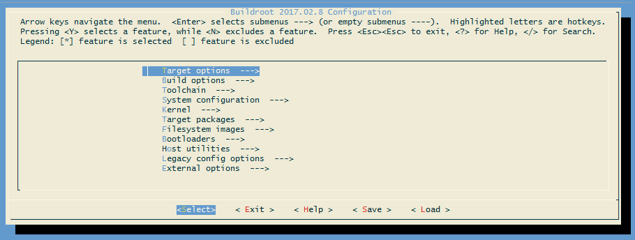
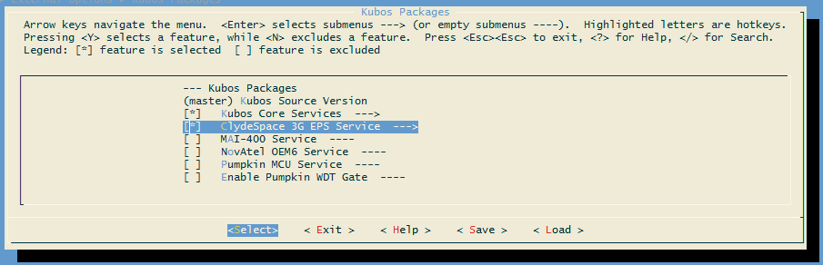
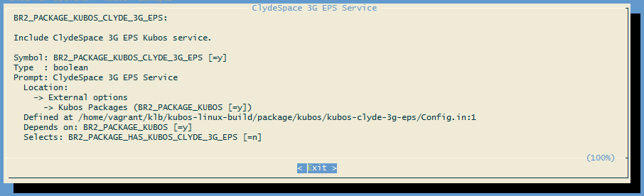

Configuring Kubos Linux
=======================

The default build configurations included in the `kubos-linux-build <https://github.com/kubos/kubos-linux-build/tree/master/configs>`__ repo
will include the :doc:`Kubos core services <../services/core-services>`, but not any of the available :doc:`hardware services <../services/hardware-services>`.

As a result, customers will need to manually enable the services and packages corresponding to the devices present in their system.

Additionally, customers may create and include their own :doc:`system packages <TODO>`.

Reference Documents
-------------------

- :doc:`kubos-linux-on-bbb`
- :doc:`kubos-linux-on-iobc`
- :doc:`kubos-linux-on-mbm2`

Selecting Hardware Services
---------------------------

Once the build environment has been set up, the build target has been set, and, optionally, a full build has been run,
you may edit the build configuration to select additional packages.

From the `buildroot-2017.02.8` directory, run ``sudo make menuconfig``. This will bring up the graphical configuration interface.

   Buildroot Configuration Interface
   
Using the down arrow key, navigate to ``External Options``. Press the `Enter` key to enter the sub-menu.
You should see the ``Kubos Packages`` option, which has already been enabled.

From here, press `Enter` to go into the Kubos Packages sub-menu. You should now see all the Kubos packages which can be enabled.

Using the up/down arrow keys, navigate to the package you would like to include and then press the space bar to enable it.

   Kubos Package Selection
   
You will notice that, once a package is selected, an arrow appears to the right of it. This indicates that a new sub-menu is now available.

If you enter the sub-menu, you will be presented with the options for that particular package.
For most Kubos services, this will be a single option which allows you to specify the run level at which the service will be initialized
during system startup. For non-boolean options, select the option and then press `Enter` in order to update the field with the desired value.
Press `Enter` again to save the new value and return to the previous menu.

For more information about any of the options in this menu system, navigate to the option and then press `Shift+?`.
This will display the option's help information. Press the `Enter` key to exit.

   Buildroot Option Description
   
To navigate back up the menu tree, use the right arrow key to select ``<Exit>`` and then press `Enter`.

Once you have selected all the desired packages and options, select ``<Exit>`` until you are presented with the
`"Do you wish to save your new configuration"` dialog. Press `Enter` to accept the changes.

Now that configuration is complete, run ``sudo make`` in order to build the newly selected packages.

Saving the Configuration for Re-Use
-----------------------------------

If you would like to save the custom configuration you have created, run ``sudo make savedefconfig``.
This will overwrite the configuration file you intially set for the build. For example, ``kubos-linux-build/config/pumpkin-mbm2_defconfig``.

Going forward, this new file can be fed into any new builds, removing the need to manually select the additional packages.
