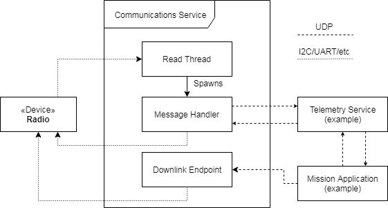

Communications Service Framework
================================

The hardware used to establish communication between a satellite and the ground varies wildly from
mission to mission.
As a result, KubOS provides a communications service framework which can be used by developers when
creating their specific radio's hardware service.
This framework is used to simplify the process of reading messages from the ground, forwarding them
to the appropriate internal destination, and then sending properly formatted messages back to the
ground.
This framework is meant to be an extension of a hardware service, such that the hardware service GraphQL interface is used for commanding and telemetry to/from the radio hardware itself.
For example, powering on/off, configuring downlink frequencies, getting health and status, etc. would be accomplished through the hardware service GraphQL interface.

.. note::

    The communications service framework is currently only available in Rust. As a result, services
    wishing to utilize the framework should also be written in Rust.

Architecture
------------

Data Packets
~~~~~~~~~~~~

All packets sent to/from the communication device will be encapsulated in several layers.

.. uml::

    @startuml

    package "Radio Protocol" {
        package "UDP" {
            rectangle "Message Data"
        }
    }

    @enduml

The first layer will be whatever communication protocol the device requires.
For example, AX.25 is frequently used as the header protocol for radio communication.

Inside of this will be a UDP packet containing one of the following:

- GraphQL query or mutation
- JSON GraphQL responses
- File/shell service commands or data
- Any other application data a payload or mission application might need

Ground Communication
~~~~~~~~~~~~~~~~~~~~

The communications service maintains a constant read thread which listens for messages from the
ground via the communications device.

Once a message is received, a message handler thread is spawned. This message handler examines the destination
port embedded in the message's UDP packet header to determine the internal message destination
and then makes an HTTP POST to the appropriate service.
The handler then waits for a response (within a specified timeout duration), wraps the response in a
UDP packet, and then sends the packet to the communications device for transmission.
Once this transaction has completed, the message handler thread exits.

.. uml::

    @startuml

    hide footbox

    actor "Ground Station" as ground
    participant Radio

    ground -> Radio : 1. Send command to satellite

    box "Communications Service" #LightBlue
        participant "Read Thread" as read

        Radio <- read : 2. Read data packets from radio
        read -> read : 3. Deframe data packets
        read -> read : 4. Reassemble data packet

        create "Message Handler" as handler
        read -> handler : 5. Spawn new message handler
        activate handler
    end box

    participant "Kubos Service" as service

    handler -> service : 6. Posts GraphQL query/mutation to service
    service -> handler : 7. Return result of query/mutation
    handler -> handler : 8. Wrap result in UDP packet
    handler -> Radio : 9. Send response packet to radio
    destroy handler

    Radio -> ground : 10. Send response packet to ground

    @enduml

Downlink Endpoints
~~~~~~~~~~~~~~~~~~

There are some instances where the satellite might need to send a message to the ground without
first receiving a request for data.
An example would be when sending a periodic health-and-status beacon.

In this case, the communications service may be defined with a downlink endpoint thread (or multiple
threads if more than one method may be used for downlink communication).

Each endpoint is assigned its own UDP port and maintains a constant read thread which listens for
messages from within the satellite which should be transmitted.

When the endpoint's read thread receives a message, it wraps it up in a UDP packet and then sends
it to the communications device, via the user-defined write function.

.. uml::

    @startuml

    hide footbox

    actor "Mission application" as app
    participant "Communications Service\nDownlink Endpoint" as downlink
    participant Radio
    actor "Ground Station" as ground

    app -> downlink : 1. Send data to downlink endpoint
    downlink -> downlink : 2. Wrap data in UDP packet
    downlink -> Radio : 3. Send data packet to radio
    Radio -> ground : 4. Send data packet to ground

    @enduml

Configuration
-------------

Most missions tend to have a single communications device which communicates via a single uplink
and single downlink method.
However, some missions have more complex communications systems; for example, having a slower, but
more reliable downlink method for transmitting a small health-and-status beacon and then a faster,
but more error-prone method for transmitting more detailed telemetry information.

The communications service framework provides mechanisms to handle these more complex
configurations.

The service's :doc:`config.toml <../services/service-config>` file should contain the following parameters:

- ``max_num_handlers`` - (Default: 50) The maximum number of concurrent message handlers allowed
- ``downlink_ports`` - (Optional) List of ports used by downlink endpoints that send messages to the
  ground. Each port in the list will be used by one downlink endpoint
- ``timeout`` - (Default: 1500) Length of time a message handler should wait for a reply, in milliseconds
- ``ground_ip`` - (Required) IP address of the ground gateway
- ``ground_port`` - (Required if ``downlink_ports`` is present) UDP port of the ground gateway
- ``satellite_ip`` - (Required) IP address of the communications service

The service which implements the framework should create a |CommsControlBlock|, which
provides the final configuration to the main communication logic.
It contains the following members:

- ``read_conn`` - This is the connection structure which is used for reading from the communications
  device, for example a UART port or UDP socket
- ``write_conn`` - This is the connection structure which is used for reading from the
  communications device, for example a UART port or UDP socket
- ``read`` - (Optional) A pointer to the function which should be used to read a message from the
  communications device
- ``write`` - A list of function pointers for all available ways that messages may be written to
  the communications device
- ``max_num_handlers`` - Should be copied from the corresponding `config.toml` value
- ``downlink_ports`` - Should be copied from the corresponding `config.toml` value or ``None``
- ``timeout`` - Should be copied from the corresponding `config.toml` value
- ``ground_ip`` - Should be copied from the corresponding `config.toml` value
- ``ground_port`` - Should be copied from the corresponding `config.toml` value
- ``satellite_ip`` - Should be copied from the corresponding `config.toml` value

.. warning::

    If downlink endpoints are being used, the number of function pointers in the ``write`` list
    **must be equal** to the number of ports in the ``downlink_ports`` list.

Implementation
--------------

Because communication methods may vary from mission to mission, it is up to the user to create the
final hardware service/s which will be used for communication with the ground.

The service which implements the communications service framework should utilize only a single
communication device.
If multiple devices are present in the system, a service should be created for each of them.

The service should contain the following components:

- A function capable of reading messages from the communications device
  (note: this may be omitted in the case where the communications device will only be used for
  transmitting data)
- At least one function capable of writing messages to the communications device
- Initialized connection structure/s which will be used by the previous read and/or write functions
- A |CommsControlBlock| structure containing all of the communications configuration
  information
- A |CommsTelemetry| structure which will be used to gather communication statistics

It is recommended that the service also follow the guidelines for
:doc:`normal hardware services <hardware-services>`.

Some support for communicating with specific hardware devices has been provided in various
:doc:`hardware APIs <../apis/device-api/index>`.

For more information about how to implement a communications service, please refer to the following
resources:

- |comms-service|
- :doc:`Comms service tutorial <../../tutorials/comms-service>`

.. |comms-service| raw:: html

    <a href="../../rust-docs/comms_service/index.html" target="_blank">Framework Rust documentation</a>

.. |CommsControlBlock| raw:: html

    <a href="../../rust-docs/comms_service/struct.CommsControlBlock.html" target="_blank">CommsControlBlock</a>

.. |CommsTelemetry| raw:: html

    <a href="../../rust-docs/comms_service/struct.CommsTelemetry.html" target="_blank">CommsTelemetry</a>
