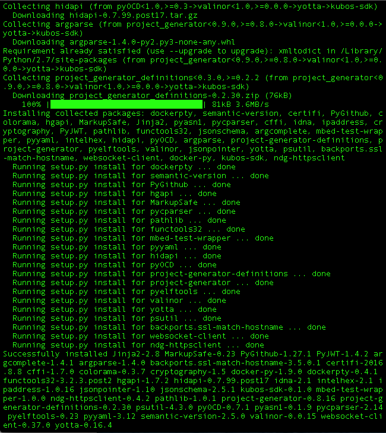

# Installing KubOS-SDK

## Prerequisites

### Install Docker

If you don't already have Docker installed see the Docker downloads for [Mac OS X](https://www.docker.com/products/docker-toolbox) or the installation docs for [Linux](https://docs.docker.com/engine/installation/). You should also read the [prerequisites](https://docs.docker.com/docker-for-mac/#/what-to-know-before-you-install) for Mac OS X or your Linux distribution specific documentation on permissions and creating a docker user group. For an example see [Create a Docker group](https://docs.docker.com/engine/installation/linux/ubuntulinux/#create-a-docker-group) for Ubuntu Linux.  

        $ docker --version

The Kubos-SDK has been tested on Docker version 1.11.1 and 1.12.0.

### Install pip

`pip` is a python package installer and manager. From [Wikipedia](https://en.wikipedia.org/wiki/Pip_(package_manager)), "pip is a recursive acronym that can stand for either 'Pip Installs Packages' or 'Pip Installs Python'."

If pip is already installed, ensure that your version is up to date with

        $ pip --version

and

        $ pip install --upgrade pip

or if you have permissions issues:

        $ pip install --user python --upgrade pip

You should not need to use `sudo`.
Similarly, you may need to upgrade other tools, such as `setuptools`.
Further, Mac OS X's new security model ("System Integrity Protection") may make
the upgrades impossible without declaring that you want to use `pip` as the
"python" user.

        $ pip install --user python --upgrade  setuptools

#### Linux
##### Ubuntu/Debian

        $ sudo apt-get install python-pip

##### Fedora

        $ sudo yum upgrade python-setuptools
        $ sudo yum install python-pip python-wheel

For other Linux distributions, see the  [pip installation guide](https://pip.pypa.io/en/stable/installing/).

##### Mac OS X

Using easy_install:

        $ sudo easy_install pip

Using homebrew:

        $ brew install pip

Using macports:

        $ sudo port install py-pip pip_select

You should ensure that your PATH variable includes the directory where
these executables are installed. Some software installers use the
`/Users/yourusername/Library/Python/2.7/bin` directory, which means
you would have to include this directory in the `/etc/paths` file
(and note this
file is owned by root and must therefore be edited using `sudo`).
If `kubos update` or any other `kubos` command is not working, this
change may provide a solution.

## Installing Dependencies

As with most software, there are several different libraries to which KubOS-SDK needs access to enable its functionality. Some of these prerequisites are needed just to _install_ the SDK and some are required for _running_ the SDK.

Below are installation commands for several popular Linux distros. Those running current or very recent versions of Mac OS X should not need to install additional libraries.

#### Linux
##### Ubuntu/Debian

        $ sudo apt-get install build-essential libxml2-dev libxslt1-dev zlib1g-dev  wget python-dev  libffi-dev libssl-dev python-setuptools libjim-dev libdw-dev

##### Fedora

        $ sudo yum install gcc redhat-rpm-config python-devel libffi-devel openssl-devel python-setuptools jimtcl

##### OpenSuse

        $ sudo zypper install gcc python-dev libffi-dev openssl-devel python-setuptools dracut systemd-sysvinit udev

## Installing KubOS-SDK

The KubOS-SDK is distributed using `pip`. You can install using this command:

        $ pip install kubos-sdk

or

        $ pip install --user python kubos-sdk

(to avoid those potential permissions errors on Mac OS X).

Things should progress for a few minutes, followed by a screen that mostly looks like the following:

--- 
 
 ---

KubOS-SDK is currently only supported in 64-bit OSX and Linux environments.

Next, start Docker's service or daemon. If you get an error that says

`Error: Unable to communicate with the Docker service. Please ensure this service is running and you have permission to access it.`

you have not started the Docker service.

Pull the latest Kubos-SDK Docker container:

        $ kubos update

And, as before, if the command fails, the `kubos` binary may not be present in your PATH variable.
