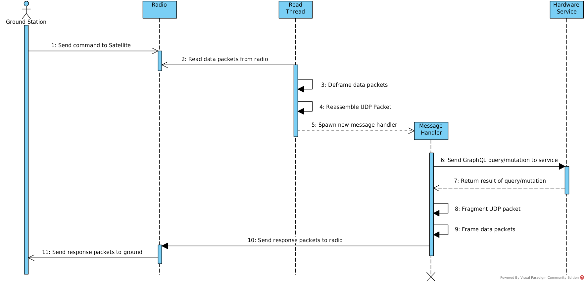
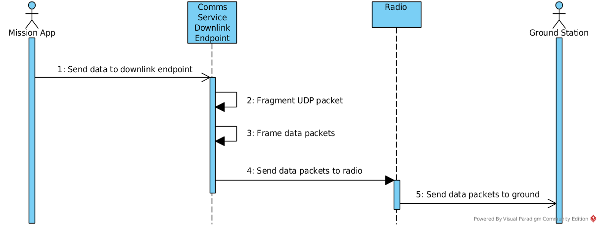

Communications Service
======================

The hardware used to establish communication between a satellite and the ground varies wildly from
mission to mission.
As a result, the communications service provided by KubOS is not a true service.
Instead, it is a framework which can be used to establish communications on a per-device basis.

.. note::

    The communications service framework is currently only available in Rust. As a result, services
    wishing to utilize the framework should also be written in Rust.

Architecture
------------

TODO: Overall architecture diagram

Data Packets
~~~~~~~~~~~~

All packets sent to/from the communication device will be encapsulated in several layers.

The first layer will be whatever communication protocol the device requires.
For example, AX.25 is frequently used as the header protocol for radio communication.

Inside of this will be a UDP packet, most likely containing a GraphQL request intended for one of
the KubOS or payload services.

TODO: Packet diagram?

Ground Communication
~~~~~~~~~~~~~~~~~~~~

The communications service maintains a constant read thread which listens for messages from the
ground via the communications device.

Once a message is received, a message handler thread is spawned and assigned one of the available
handler UDP ports.
This message handler examines the message to determine the internal message destination and then
forwards it on to the appropriate service.
The handler then waits for a reply (within a specified timeout duration), wraps the response in a
UDP packet, and then sends the packet to the device for transmission.

Downlink Endpoints
~~~~~~~~~~~~~~~~~~

There are some instances where the satellite might need to send a message to the ground without
first receiving a request for data.
An example would be when sending a periodic health-and-status beacon.

In this case, the communications service may be defined with a downlink endpoint thread (or multiple
threads if more than one method may be used for downlink communication).

Each endpoint is assigned its own UDP port and maintains a constant read thread which listens for
messages from within the satellite which should be transmitted.

When the endpoint's read thread receives a message, it wraps it up in a UDP packet and then sends
it to the endpoint device, via the :doc:`appropriate hardware API <../apis/device-api/index>`.

Configuration
-------------

Most missions tend to have a single communications device which communicates via a single uplink
and single downlink method.
However, some missions have more complex communications systems; for example, having a slower, but
more reliable downlink method for transmitting a small health-and-status beacon and then a faster,
but more error-prone method for transmitting more detailed telemetry information.

The communications framework provides mechanisms to handle these more complex configurations.

The service's `config.toml` file should contain the following parameters:

- ``handler_port_min`` - Starting port used to define a range of ports that are used in the message
  handlers that handle messages received from the ground
- ``handler_port_max`` - Ending port used to define a range of ports that are used in the message
  handlers that handle messages received from the ground
- ``downlink_ports`` - (Optional) List of ports used by downlink endpoints that send messages to the
  ground each port in the list will be used by one downlink endpoint
- ``timeout`` - Length of time a message handler should wait for a reply, in milliseconds
- ``ground_ip`` - IP address of the ground gateway
- ``ground_port`` - UDP port of the ground gateway
- ``satellite_ip`` - IP address of the communications service

The service which implements the framework should create a `CommsControlBlock <TODO>`, which
provides the final configuration to the main communication logic.
It contains the following members:

- ``read_conn`` - This is the connection structure which is used for reading from the communications
  device, for example a UART port or UDP socket. It should implement the Read trait.
- ``write_conn`` - This is the connection structure which is used for reading from the
  communications device, for example a UART port or UDP socket. It should implement the Write trait.
- ``read`` - (Optional) A pointer to the function which should be used to read a message from the
  communications device
- ``write`` - A list of function pointers for all available ways that messages may be written to
  the communications device
- ``handler_port_min`` - Should be copied from the corresponding `config.toml` value
- ``handler_port_max`` - Should be copied from the corresponding `config.toml` value
- ``downlink_ports`` - Should be copied from the corresponding `config.toml` value or ``None``
- ``timeout`` - Should be copied from the corresponding `config.toml` value
- ``ground_ip`` - Should be copied from the corresponding `config.toml` value
- ``ground_port`` - Should be copied from the corresponding `config.toml` value
- ``satellite_ip`` - Should be copied from the corresponding `config.toml` value

Implementation
--------------

Because communication methods may vary from mission to mission, it is up to the user to create the
final hardware service/s which will be used for communication with the ground.

The service which implements the communications framework should utilize only a single communication
device.
If multiple devices are present in the system, a service should be created for each of them.

The service should contain the following components:

- A function capable of reading messages from the communications device
  (note: this may be omitted in the case where the communications device will only be used for
  transmitting data)
- At least one function capable of writing messages to the communications device
- Initialized connection structure/s capable of reading and/or writing from/to the communications
  device (this structure will be used by the previous read and/or write functions)
- A `CommsControlBlock <TODO>` structure containing all of the communications configuration
  information

It is recommended that the service also follow the guidelines for
:doc:`normal hardware services <hardware-services>`.

For more information about how to implement a communications service, please refer to the following
resources:

- `Rust documentation <TODO>`
- `Comms service tutorial <TODO>`