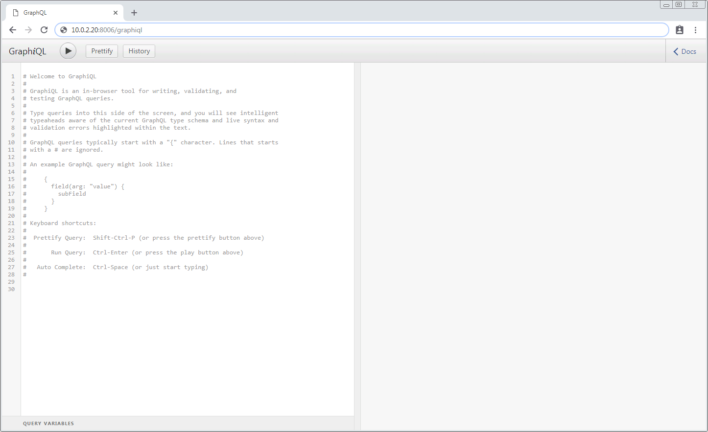
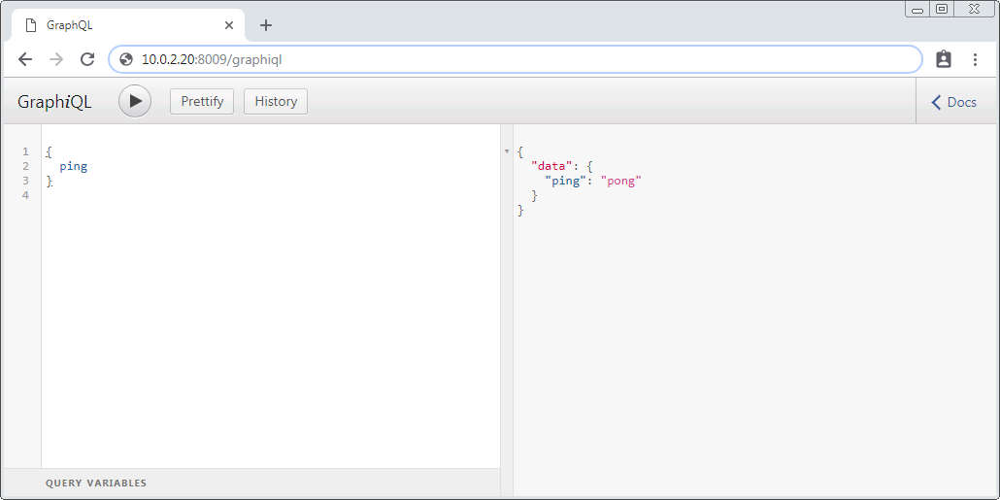

Registering a Mission Application
=================================

The Kubos :doc:`applications service <../ecosystem/services/app-service>` is responsible for monitoring and
managing all mission applications for a system.

This tutorial walks the user through:

    - Registering a new application
    - Sending a request to the applications service to start the application
    - Updating the application to a newer version
    - Verifying what versions of the application have been registered

This tutorial is written to be run entirely within your local development environment, however, you
may also interact with the applications service on your OBC by setting up its :ref:`ethernet connection <ethernet>`.

Setup
-----

We'll be using the example application from the :doc:`mission application tutorial <first-mission-app>`.
Make sure that the `manifest.toml` file is present in the same project directory.

This tutorial will use the following example directories:

    - ``/home/user/my-app`` - Project directory
    - ``/home/user/kubos`` - Cloned copy of the kubos repo
    - ``/home/user/kubos/app-registry`` - Directory used by the applications service to store registered
      applications

- Navigate to the `kubos` source directory
- **If you are using the SDK**, update all IP addresses in the ``tools/local_config.toml`` file,
  changing them from ``127.0.0.1`` to ``0.0.0.0``, so that they are available :ref:`to your host machine <sdk-port-forward>`.

- Run the following command to start the applications service in the background (the service may
  need to be built first, which will take several minutes to complete)::
  
    $ cargo run --bin kubos-app-service -- -c tools/local_config.toml &
    
- If you have stopped the monitor and telemetry services since going through the previous tutorial,
  you will need to start those as well::
  
    $ cargo run --bin monitor-service -- -c tools/local_config.toml &
    $ cargo run --bin telemetry-service -- -c tools/local_config.toml &
  
- Navigate back out to the development directory of your choosing.

.. _graphiql:

GraphiQL
--------

All Kubos services which provide an HTTP interface have a special endpoint which can be used to
send and receive GraphQL data via an in-browser graphical interface, GraphiQL.

This graphical interface makes it easier to create and consume more lengthy GraphQL requests.

To access this endpoint, make sure that your desired service is running, then open a web browser and
navigate to ``http://{ip}:{port}/graphiql``.
The ``ip`` and ``port`` parameters should match the values specified for the service in its
``config.toml`` file.

The resulting interface should look like this:

From here, you can enter any valid GraphQL query or mutation on the left-hand side and then run
the request by clicking the triangle button.
The resulting JSON response will be displayed on the right-hand side:

Please navigate to ``http://127.0.0.1:8000/graphiql`` in order to communicate with the applications
service for this tutorial.

If you are using the SDK, replace ``127.0.0.1`` with the :ref:`IP address you defined <sdk-port-forward>`
for your VM.

.. note::

    You may also send GraphQL requests by using the `curl <https://linux.die.net/man/1/curl>`__
    facility. Requests should be sent as POST operations, specifying the GraphQL request inside the
    body of the message under the "query" parameter. The content-type for the message should be
    "application/json".
    
    For example::
    
        $ curl 127.0.0.1:8004 -H "Content-Type: application/json" --data "{\"query\":\"{ping}\"}"

Registering
-----------

To register an application, we use the service's ``register`` mutation.
It has the following schema::

     mutation {
        register(path: String!) {
            success: Bool!,
            errors: String,
            entry: {
                app: {
                    name: String!,
                    version: String!,
                    author: String!,
                    executable: String!
                },
                active: Bool
            }
        }
     }
     
The ``path`` input parameter specifies the path to either a directory where the application and manifest files reside,
or the path to a ``.tgz`` archive file containing the application and manifest in its root.

.. note::

    When interacting with the applications service on an OBC, this ``path`` parameter refers to a
    location *on the OBC*, not in your local development environment

The registration process will copy all of the contents at that path, so care should be taken to
ensure that only the desired application files are present.

The mutation can return the following fields:

    - ``success`` - Indicating the overall result of the register operation
    - ``errors`` - Any errors which were encountered while registering the application

    - ``entry`` - The registration information about the newly registered application.
      Will be empty if the registration process fails

        - ``app``

            - ``name`` - The name of the registered application, taken from the manifest file
            - ``version`` - The version number of this particular iteration of the application, taken
              from the manifest file
            - ``author`` - The author information for the application, taken from the manifest file
            - ``executable`` - The absolute path of the file which will kick off execution of the
              newly registered application file

        - ``active`` - Specifies whether the newly registered application is the current active version
          of the application which will be used when the service attempts to run it. This value should
          always be ``true`` when returned by this mutation

We'll be interacting with our local applications service's GraphiQL interface.
Our service is using port 8000.

Our registration mutation should look like this::

    mutation {
      register(path: "/home/user/my-app") {
        success,
        errors,
        entry {
          app {
            name
            executable
          }
        }
      }
    }
    
The response should like this::

    {
      "data": {
        "register": {
          "success": true,
          "errors": "",
          "entry": {
            "app": {
              "name": "my-mission-app",
              "executable": "/home/user/kubos/app-registry/my-mission-app/1.0/my-mission-app.py"
            }
          }
        }
      }
    }

We can break down the resulting executable path like so:

    - ``/home/user/kubos/app-registry`` - This is the directory that the applications service uses to
      save all registered applications. We previously specified it in our ``config.toml`` file
    - ``my-mission-app`` - The name of our application
    - ``1.0`` - Our manifest file specified that this was version 1.0 of our application
    - ``my-mission-app.py`` - Our application file

Starting
--------

We'll go ahead and start our app now to verify it works using the ``startApp`` mutation.
It has the following schema::

    mutation {
        startApp(name: String!, config: String, args: [String]): {
            success: Bool!
            errors: String,
            pid: Int
        }
    }

The ``name`` input parameter specifies the name of the application which should be started.
The ``config`` input parameter specifies a non-default configuration file which should be used.
The ``args`` input parameter allows the user to pass additional arguments through to the underlying
application.

The mutation returns three fields:

    - ``success`` - Indicating the overall result of the operation
    - ``errors`` - Any errors which were encountered while starting the application
    - ``pid`` - The PID of the started application. This will be empty if the application
      immediately finishes, since the PID will already have been freed by the system and is no
      longer meaningful

Our request should look like this::

    mutation {
      startApp(name: "my-mission-app", config:"/home/user/kubos/tools/local_config.toml") {
        success,
        pid
      }
    }

And the response should look like this::

    {
      "data": {
        "startApp": {
          "success": true,
          "pid": 575
        }
      }
    }

The console where you started the app service should show the app's execution messages::

    Current available memory: 4390792 kB
    Telemetry insert completed successfully

Updating
--------

After looking at our output, it would be nice if our memory message included the timestamp of
when the system was checked.

Let's add the ``datetime`` module to our file with ``import datetime`` and then update the log line like so:

.. code-block:: python

    print("%s: Successfully pinged monitor service" % (str(datetime.datetime.now())))

Since this is a new version of our application, we'll then need to update our ``manifest.toml``
file to change the ``version`` key from ``"1.0"`` to ``"2.0"``.

After transferring both of the files into our remote folder, ``/home/user/my-app``,
we can register the updated application using the same ``register`` mutation as before::

    mutation {
      register(path: "/home/user/my-app") {
        success,
        errors,
        entry {
          app {
            name
            executable
          }
        }
      }
    }

The response should look almost identical::

    {
        "errors": "",
        "data": {
            "register": {
                "success": true,
                "errors": "",
                "entry": {
                    "app": {
                        "name":"my-mission-app",
                        "executable":"/home/user/kubos/app-registry/my-mission-app/2.0/my-mission-app.py"
                    }
                }
            }
        }
    }
    
After running our app again with the ``startApp`` mutation, our output should now look like this:

.. code-block:: none

    2019-07-03 16:15:29.452626: Successfully pinged monitor service
    Telemetry insert completed successfully

Verifying
---------

We can now query the service to see the registered versions of our application using the ``registeredApps`` query.

The query has the following schema::

    {
        registeredApps(name: String, version: String, active: Bool): [{
            app: {
                name: String!,
                version: String!,
                author: String!,
                executable: String!
            },
            active: Bool
        }]
    }
    
By default, the query will return information about all versions of all registered applications.
The queries input fields can be used to filter the results:

    - ``name`` - Returns entries with this specific application file name
    - ``version`` - Returns only entries with the specified version
    - ``active`` - Returns only the current active version of the particular application

The query has the following response fields:

    - ``app``

        - ``name`` - The name of the application
        - ``version`` - The version number of this particular iteration of the application
        - ``author`` - The author information for the application
        - ``executable`` - The absolute path of the file which will kick off execution of the
          registered application file

    - ``active`` - Specifies whether this iteration of the application is the current active version
      which will be used when the service attempts to run it

We want to query the service to make sure that:

    - We have two registered versions of our application
    - Version 2.0 is the current active version

Our request should look like this::

    {
      registeredApps(name: "my-mission-app") {
        active
        app {
          name
          version
        }
      }
    }

The response should look like this::

    {
        "data": {
            "registeredApps": [
                {
                    "active":false,
                    "app": {
                        "name":"my-mission-app",
                        "version":"1.0"
                    }
                },
                {
                    "active":true,
                    "app": {
                        "name":"my-mission-app",
                        "version":"2.0"
                    }
                }
            ]
        }
    }
