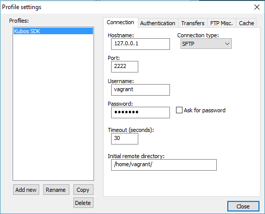

Setting up the Kubos Windows Development Environment
====================================================

What is the Kubos Windows Development Environment?
--------------------------------------------------

The Kubos Windows Development Environment is a way to edit files on the SDK through an IDE. Since Windows does not support symlinks, editing the files can be a pain, as they are only accessible to tools within the SDK such as vim or nano. This guide walks through a single method to edit those files through an IDE on the host machine, rather than through these command line tools. 

.. Note:: 
	Before proceeding, please make sure you have :doc:`installed the SDK. <sdk-installing>`

How does it work?
-----------------

The environment is set up to treat the SDK like a remote machine, and uses an automatic FTP plug-in to allow the user to view and edit files on the SDK as if they were being edited locally. 

The chosen environment consists of:

- Notepad++
- NppFTP Plugin

This same method can be used with many common IDEs that have FTP packages for working on remote servers. 
  
Installation
------------
  
Install Notepad++ `here. <https://notepad-plus-plus.org/download/v7.4.2.html>`_ Unless you know what you're doing and want to use something else, choose the first option of the installer: "Notepad++ Installer 32-bit x86". Choose all the default options in the installer (unless, as it states, you know what you're doing).

Install the NppFTP plugin using the Plugin Manager.

- Go to "Plugins" -> "Plugin Manager" -> "Show Plugin Manager"
- Under "Available", find "NppFTP". Click the box next to it to select it, then select "Install". 

**Note:** It might prompt you to update the Plugin Manager before installing. I would recommend doing this once. It will require a restart of Notepad++, and you will have to repeat all the steps. If it prompts again after the first time, select "No" and it should install normally. 

- It should restart Notepad++, you should now see "NppFTP" as one of the options under "Plugins". 

Setup
-----

Find the Vagrant configuration parameters 
~~~~~~~~~~~~~~~~~~~~~~~~~~~~~~~~~~~~~~~~~

Go to the install location of the Kubos SDK and bring up your Vagrant. As it initializes, it will output its configuration:

::

		$ vagrant up
		Bringing machine 'default' up with 'virtualbox' provider...
		==> default: Checking if box 'kubostech/kubos-dev' is up to date...
		==> default: A newer version of the box 'kubostech/kubos-dev' is available! You currently
		==> default: have version '0.2.3'. The latest is version '1.0.1'. Run
		==> default: `vagrant box update` to update.
		==> default: Clearing any previously set forwarded ports...
		==> default: Clearing any previously set network interfaces...
		==> default: Preparing network interfaces based on configuration...
		    default: Adapter 1: nat
		==> default: Forwarding ports...
		    default: 22 (guest) => 2222 (host) (adapter 1)
		==> default: Booting VM...
		==> default: Waiting for machine to boot. This may take a few minutes...
		    default: SSH address: 127.0.0.1:2222
		    default: SSH username: vagrant
		    default: SSH auth method: private key
		==> default: Machine booted and ready!
		==> default: Checking for guest additions in VM...
		==> default: Mounting shared folders...
		    default: /vagrant => C:/Users/jacof/Documents/git/kubos
		    default: /vagrant_data => C:/Users/jacof/Documents/git/kubos
		==> default: Machine already provisioned. Run `vagrant provision` or use the `--provision`
		==> default: flag to force provisioning. Provisioners marked to run always will still run.

Record the SSH address (127.0.0.1:2222) and the SSH username (vagrant).

If the VM is already up, you can also issue ``vagrant ssh-config`` to get the hostname and port info. 

.. Note:: 
	If you update your Vagrant box, this could change. 

Configure NppFTP to access the SDK
~~~~~~~~~~~~~~~~~~~~~~~~~~~~~~~~~~

- Go to "Plugins" -> "NppFTP" -> "Show NppFTP Window". This should bring up the NppFTP windown on the right side. 
- In the NppFTP window, go to "Settings" (the gear) -> "Profile Settings"
- Select "Add New" in the bottom left, and name it "Kubos SDK".
- Edit the settings to match the picture below. You'll need to input: 

  + Hostname and Port from the SSH address recorded previously
  + Username: "vagrant"  
  + Password: "vagrant"
  + Initial remote directory: "/home/vagrant/"
  + Connection type: SFTP

Usage
-----

Connect to the Vagrant box by selecting "(Dis)Connect" -> "Kubos SDK". This should automatically pull up the file system of the Vagrant with the /home/vagrant directory open. It should say "NppFTP - Connected to Kubos SDK" at the top of the NppFTP window. 

Now you can open and edit files! Double clicking on a file in the file tree will open it locally. If you make changes to any file, it will automatically tranfer the file over and replace it on the host machine whenever you hit save. 

