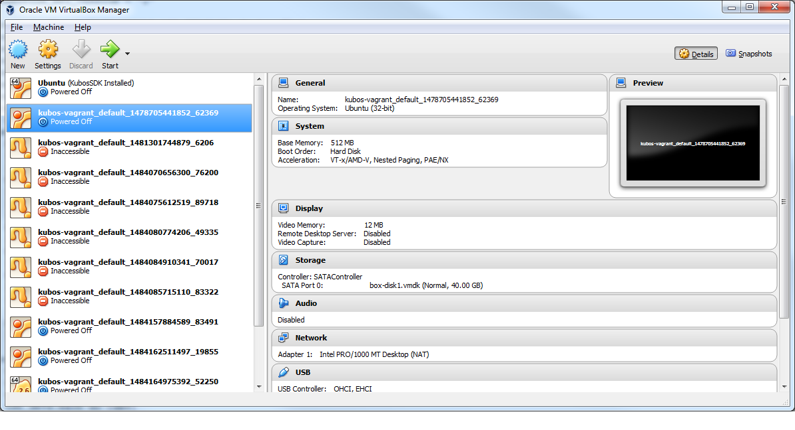
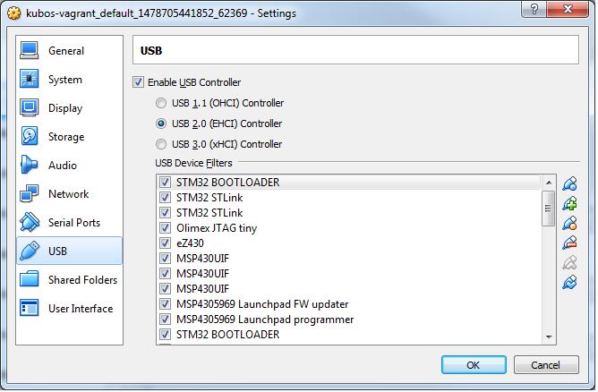
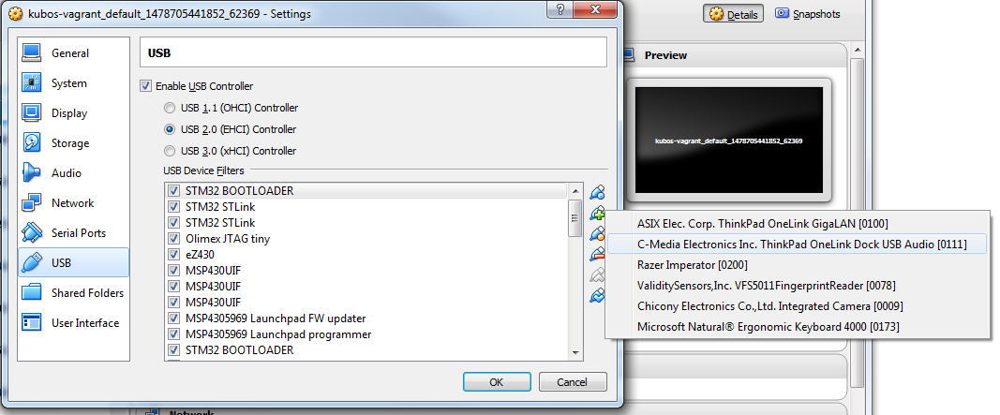

Working with the Pumpkin MBM2
=============================

Overview
--------

This document is intended as an introductory guide for creating,
loading, and using Kubos projects and other files within the user space
of KubOS Linux on the Pumpkin Motherboard Module 2.

Reference Documents
-------------------

-  :doc:`Installing the Kubos SDK <sdk-installing>` - Basics of
   setting up the Kubos SDK environment
-  :doc:`Creating your first KubOS Linux project <first-linux-project>` - Steps to
   create and build a Kubos SDK project
-  :doc:`SDK Command Reference <sdk-reference>` - Overview of the
   common Kubos SDK commands
-  :doc:`KubOS Linux Overview <kubos-linux-overview>` - Overview of
   the KubOS Linux components
-  :doc:`KubOS Linux on Pumpkin MBM2 <kubos-linux-on-mbm2>` - Steps to
   build and load KubOS Linux for the Pumpkin MBM2

Building a Project
------------------

In order to build a project for the MBM2, you'll need to create a
Kubos SDK project for KubOS Linux, set the correct target, and then
build it.

::

    $ kubos init -l newproj
    $ kubos target kubos-linux-pumpkin-mbm2-gcc
    $ kubos build

.. _updating-credentials:

Updating Credentials
--------------------

Ideally, you should not be using the default root user password. If
you've changed it, you'll need to pass the new password to the Kubos
flash utility through the config.json file, which should be located in
the top-level directory of your project. You'll need to create the file
if it doesn't already exist. Update the :json:object:`system.password <system>` parameter with
the password to use.

If you're creating a brand new config.json file, you can just copy and
paste the text below (*newpass* should be your desired password):

::

    {
        "system" : {
            "password" : "newpass"
        }
    }

Setting Initialization Configuration
------------------------------------

There are several :json:object:`config.json <system>` options available which customize how and
when a user application is started:

-  system.initAfterFlash - (Default: false) Tells the Kubos SDK whether
   to start the application as a background daemon after flashing it to
   the board.
-  system.initAtBoot - (Default: true) Tells the Kubos SDK whether to
   generate and install an initialization script.
-  system.runLevel - (Default: 50. Range: 10-99) Sets priority of
   initialization script.

When the :json:object:`system.initAfterFlash <system>` option is turned on, the user
application will be started as a background daemon at the end of the
``kubos flash`` process. This is done using Linux's
``start-stop-daemon`` command. By default this feature is turned off, so
the value of the option will need to be set to "true" by the user in
order to turn it on.

By default, an initialization script will be generated and installed
during the flashing process. This script will follow the naming
convention of "S{runLevel}{applicationName}", where "runLevel" is the
initialization priority order of the script. All user application init
scripts will be run after all of the Kubos init scripts, but within the
user scripts, the scripts with the lowest run level will be executed
first. So an application with a run level of 10 will be initialized
before an application with a run level of 50.

To turn this feature off, set the :json:object:`system.initAfterBoot <system>` option to
"false".

The run level of an initialization script can be changed after initially
flashing the script to the board. Simply change the :json:object:`system.runLevel <system>`
value, rebuild the project, and then reflash it to the board. The old
script will be removed as part of the flash process.

Updating the USB Connection
---------------------------

The board should be shipped with an FTDI cable. This cable should be
connected to the programming adapter, which should then be connected to
the board, to create the debug UART connection. User file transfer will
take place using this connection.

The Kubos flashing utility was configured with the assumption that an
FTDI cable would be used. If you have a different USB-to-serial cable
type, you'll need to pass through the USB connection, and then update
the minicom configuration to tell the flashing utility which USB to
flash over.

You can either pass through the USB via VirtualBox or by updating the
vagrant's Vagrantfile.

VirtualBox
~~~~~~~~~~

Open the VirtualBox Manager

   VirtualBox Manager

Right-click on your vagrant VM and select Settings. Click the USB tab.

   VM USB Options

Click the USB icon with the plus symbol to add a new USB filter. Select
the device you want to add and press OK.

   VM USB Devices

Updating the Vagrantfile
~~~~~~~~~~~~~~~~~~~~~~~~

Navigate to you vagrant installation directory on your host machine.

Open the Vagrantfile.

You should see a section labeled 'usb\_devs'. You want to add a new
entry for your USB device to the bottom of this list.

The format is

::

    ['vendor_id', 'product_id', 'Description']

The description can be whatever you want, but the vendor and product IDs
will need to be found from the connection on your host computer.

Once you've updated Vagrantfile, issue the command ``vagrant reload`` to
cause the VM to pick up the new definition. Once you've logged in to the
VM, you should be able to see the passed-through connection with the
``lsusb`` command.

On Windows
^^^^^^^^^^

1. Go to the "Start" Menu.
2. Select "Devices and Printers"
3. Double-click your USB Scale.
4. Select the "Hardware" Tab.
5. Select "Properties"
6. Select the "Details" Tab.
7. From the "Device description" Menu select "Hardware Ids"
8. Copy the numbers next to "VID\_" and "PID\_"

On Mac
^^^^^^

Issue the ``system_profiler SPUSBDataType`` command.

Copy the values in the values in the 'Product ID' and 'Vendor ID' fields

On Linux
^^^^^^^^

Issue the ``lsusb`` command.

Copy the values in the 'ID' field. The value in front of the colon
should be the vendor ID and the value after should be the product ID.

Updating the minicom configuration
~~~~~~~~~~~~~~~~~~~~~~~~~~~~~~~~~~

Navigate to /etc/minicom, you should see a file call minirc.kubos. This
is the preset minicom serial connection configuration file for KubOS
Linux.

Edit the file and update the 'pu baudrate' field and change '/dev/FTDI'
to the '/dev/\*' device name your USB connection has.

-  You can find this device by issuing ``ls /dev/``. The connection will
   likely be one of the /dev/ttyUSB\* devices.

You can test the changes by issuing the ``minicom kubos`` command. If
you successfully connect to your board, then the changes have been
successful.

Flashing the Application
------------------------

The USB-to-serial cable should be connected to the MBM2 and the board 
should be fully powered.

Assuming you've successfully built a Kubos SDK project for the board, 
when you issue the ``kubos flash`` the output should look like this:

::

    info: found newproj at source/newproj
    Compatible FTDI device found
    Sending file to board...
    Bytes Sent: 693248/1769379 BPS:8343 ETA 02:08
    Transfer Successful
    Execution time: 21 seconds

The application binary will be loaded into the /home/system/usr/bin
directory on the target board.

If the 'system.initAtBoot' option has been turned on, then a standard
initialization script will be generated and flashed into the
/home/system/etc/init.d directory automatically during the application
flashing process.

If the 'system.initAfterFlash' option has been turned on, then the
application will be started as a background service as the last step in
the application flashing process.

Flashing Non-Application Files
------------------------------

If you would like to flash a file other than the application binary onto
your board, you can add an additional parameter to the usual flash
commad:

::

    $ kubos flash {absolute-path-of-file}

If the name of the file matches the name of the application, as
specified in the module.json file, then the file is assumed to be the
application binary and will be loaded into /home/system/usr/bin on the
target board.

If the name of the file ends in \*.itb, the file is a KubOS Linux
upgrade package and will be loaded into the upgrade partition of the
target board. An internal variable will be set so that the upgrade
package will be installed during the next reboot of the target board.

All other files are assumed to be non-application files (ex. custom
shell scripts) and will be loaded into /home/system/usr/local/bin. Once
they have been flashed, these files can then be manually moved to
another location.

**Note:** The file does not need to reside within a Kubos SDK project,
but the ``kubos flash`` command must still be run from the project,
since that is where the target configuration information is stored.

For example:

::

    $ kubos flash /home/vagrant/not-my-project/test-util.sh
    
.. _flash-troubleshooting:

Flash Troubleshooting
---------------------

Flashing a file to the board can fail for various reasons. Sometimes
simply reattempting the command can correct the problem.

If retrying doesn't work, here is a list of some of the error you might
see after running the ``kubos flash`` command and the recovery actions
you can take:

"No compatible FTDI device found"

-  Check that the board is turned on and connected to your computer
-  Check that no other vagrant images are running. Only one VM can have
   control of the USB, so it may be that another instance currently has
   control of the device. You can shutdown a vagrant image with the
   command ``vagrant halt``
-  Verify that the USB is showing up within the vagrant environment with
   the ``lsusb`` command. You should see an FTDI device
-  Verify that the USB has been mapped to a linux device. Issue the
   command ``ls /dev``. You should see a /dev/ttyUSB\* device. If you
   don't, try rebooting your vagrant image (``vagrant halt``,
   ``vagrant up``)

"Transfer Failed: Connection Failed"

-  The SDK was unable to connect to the board
-  Verify that the USB has been mapped to a linux device. Issue the
   command ``ls /dev``. You should see a /dev/ttyUSB\* device. If you
   don't, try rebooting your vagrant image (``vagrant halt``,
   ``vagrant up``)
-  If this error occurs after the transfer process has started, then the
   SDK likely lost connection to the board. Verify that the board is
   still correctly connected and powered and try the flash command
   again.

"Transfer Failed: Invalid Password"

-  The SDK was unable to log into the board. Verify that the password is
   correctly defined in your config.json file by issuing the
   ``kubos config`` command.

System appears to have hung

-  If for some reason file transfer fails, it can take a couple minutes
   for the connection to time out and return control.
-  If you've waited a couple minutes and the system still appears hung,
   please let us know so that we can open a bug report.

Debug Console
-------------

If the MBM2 is correctly connected to your host computer, you should see
a /dev/ttyUSB\* device in your vagrant VM. The VM is set up to
automatically forward any FTDI cables that connect to a /dev/FTDI device
for ease-of-use.

The vagrant image comes pre-packaged with a minicom serial connection
configuration file for the board debug uart port. You can connect with
this configuration file using the command

::

    $ minicom kubos

Alternatively, you can manually create a serial connection with minicom
(or other terminal application) using the following connection
configuration:

+-------------+----------+
| Setting     | Value    |
+=============+==========+
| Baudrate    | 115200   |
+-------------+----------+
| Bits        | 8        |
+-------------+----------+
| Parity      | N        |
+-------------+----------+
| Stop Bits   | 1        |
+-------------+----------+

Once connected, you can log in using either a user that you've created,
or root, which has a default password of 'Kubos123'.

Fully logged in, the console should look like this:

::

    Welcome to KubOS Linux

    Kubos login: root
    Password: 
    Jan  1 00:00:16 login[212]: root login on 'ttyS0'
    ~ # 

Manual File Transfer
--------------------

If for some reason you want to manually transfer a specific file onto
the board, for example a custom script, you'll need to do the following:

Connect to the board through minicom (the file transfer protocol is not
guaranteed to work with any other terminal program)

::

    $ minicom kubos

Login to the board

::

    Welcome to minicom 2.7

    OPTIONS: I18n
    Compiled on Feb  7 2016, 13:37:27.
    Port /dev/FTDI, 21:26:43

    Press CTRL-A Z for help on special keys

    Welcome to KubOS Linux
    (none) login: root
    Password:
    Jan  1 00:00:11 login[210]: root login on 'ttyS0'
    ~ #

Navigate to the location you'd like the received file to go.

::

    ~ # mkdir righthere
    ~ # cd righthere
    ~/righthere #

Issue the zModem command to prep the board to receive a file

::

    $ rz -bZ

Press **Ctrl+a**, then press **s** to open the minicom file transfer
dialog.

::

    +-[Upload]--+
    | zmodem    |
    | ymodem    |
    | xmodem    |
    | kermit    |
    | ascii     |
    +-----------+

Select zmodem

::

    +-------------------[Select one or more files for upload]-------------------+
    |Directory: /home/vagrant                                                   |
    | [..]                                                                      |
    | [linux]                                                                   |
    | [newprj]                                                                  |
    | minicom.log                                                               |
    |                                                                           |
    |              ( Escape to exit, Space to tag )                             |
    +---------------------------------------------------------------------------+

                   [Goto]  [Prev]  [Show]   [Tag]  [Untag] [Okay]

Select the file to send:

Press ``g`` to open the Goto dialog and navigate to the desired folder
(full pathname required).

Press enter to open the file selector dialog and specify the file you
want within the current folder.

::

    +-------------------[Select one or more files for upload]-------------------+
    |Directory: /home/vagrant/linux/build/kubos-linux-pumpkin-mbm2-gcc/source   |
    | [..]                                                                      |
    | [CMakeFiles]                                                              |
    | CMakeLists.txt                                                            |
    | CTestTestfile.cmake                                                       |
    | cmake_install.cmake                                                       |
    | linux                                                                     |
    | linux.map                                                                 |
    |                +-----------------------------------------+                |
    |                |No file selected - enter filename:       |                |
    |                |> linux                                  |                |
    |                +-----------------------------------------+                |
    |                                                                           |
    |              ( Escape to exit, Space to tag )                             |
    +---------------------------------------------------------------------------+

                   [Goto]  [Prev]  [Show]   [Tag]  [Untag] [Okay]

You should see a progress dialog as your file is transferred to the
board.

::

    +-----------[zmodem upload - Press CTRL-C to quit]------------+
    |^XB00000000000000rz waiting to receive.Sending: linux        |
    |Bytes Sent:  41984/  99084   BPS:8905     ETA 00:06          |
    |                                                             |
    |                                                             |
    |                                                             |
    |                                                             |
    |                                                             |
    +-------------------------------------------------------------+

Once file transfer is complete, you should be able to press enter and
use your new file

::

    +-----------[zmodem upload - Press CTRL-C to quit]------------+
    |^XB00000000000000rz waiting to receive.Sending: linux        |
    |Bytes Sent:  99084   BPS:7982                                |
    |                                                             |
    |Transfer complete                                            |
    |                                                             |
    | READY: press any key to continue...                         |
    |                                                             |
    +-------------------------------------------------------------+

Press **Ctrl+a**, then **q** to bring up the dialog to exit minicom. Hit
enter to quit without reset.

Example Program
---------------

Let's walk through the steps to create the example KubOS Linux project.

Initialize the project

::

    $ kubos init --linux newproj

Move into the project folder

::

    $ cd newproj

Set the project target

::

    $ kubos target kubos-linux-pumpkin-mbm2-gcc

Build the project

::

    $ kubos build

Flash the project

::

    $ kubos flash

Log into the board

::

    $ minicom kubos
    Login: root/Kubos123

Run the example application

::

    $ newproj

Output should look like this:

::

    Initializing CSP
    Starting example tasks
    Ping result 80 [ms]
    Packet received on MY_PORT: Hello World
    Ping result 90 [ms]
    Packet received on MY_PORT: Hello World
    Ping result -1 [ms]
    Packet received on MY_PORT: Hello World
    Ping result 60 [ms]
    Packet received on MY_PORT: Hello World
    Ping result 50 [ms]
    Packet received on MY_PORT: Hello World

Press **Ctrl+C** to exit execution.

Press **Ctrl+A**, then **Q** to exit minicom.

.. todo:: 

    Using Peripherals
    <--------------->

User Accounts
-------------

In general, it is preferred to use a non-root user account to interact
with a Linux system. A default user account 'kubos' is included with
KubOS Linux. Other user accounts can be created using the standard Linux
commands (``adduser``, ``useradd``, etc).

All user accounts should have a home directory in the format
'/home/{username}'.

The ``passwd`` command can be used to change the password of existing user
accounts.

If you change the root user's password, be sure to also update the password in
any :ref:`Kubos SDK project configurations <updating-credentials>`.

KubOS Linux File System
-----------------------

There are a few key directories residing within the KubOS Linux user
space.

/home
~~~~~

All user-created files should reside under the /home directory. This
directory maps to separate partitions from the root file system. As a
result, all files here will remain unchanged if the system goes through
a kernel upgrade or downgrade.

The home directories of all user accounts, except root, should live
under this directory.

--------------

**Any files not residing under the /home directory will be destroyed
during an upgrade/downgrade** 

--------------

The Pumpkin MBM2 has multiple user data partitions available, one on each storage
device. 

eMMC
^^^^

The user partition on the eMMC device is used as the primary user data storage area.
All system-related `/home/` paths will reside here.

/home/usr/bin
#############

All user-created applications will be loaded into this folder during the
``kubos flash`` process. The directory is included in the system's PATH,
so applications can then be called directly from anywhere, without
needing to know the full file path.

/home/usr/local/bin
###################

All user-created non-application files will be loaded into this folder
during the ``kubos flash`` process. There is currently not a way to set
a destination folder for the ``kubos flash`` command, so if a different
endpoint directory is desired, the files will need to be manually moved.

/home/etc/init.d
################

All user-application initialization scripts live under this directory.
The naming format is 'S{run-level}{application}'.

uSD - /home/microsd
^^^^^^^^^^^^^^^^^^^

This directory points to a partition on the microSD device included with the 
base Beaglebone Black board

.. todo::

    SD over SPI - /home/spisd
    (header characters here)
    
    This directory points to a partition on the SD over SPI device included as a
    peripheral device of the Pumpkin MBM2 board.
    
    EEPROM - /home/eeprom
    (header characters here)
    
    This directory points to the available space of the EEPROM storage included with 
    the base Beaglebone Black board. There are 4KB of space available for use.
    
    .. note:: 
    
        While EEPROM storage is more stable and safe than MMC/SD, it also has a much
        more limited number of writes available. This storage should be used carefully.
